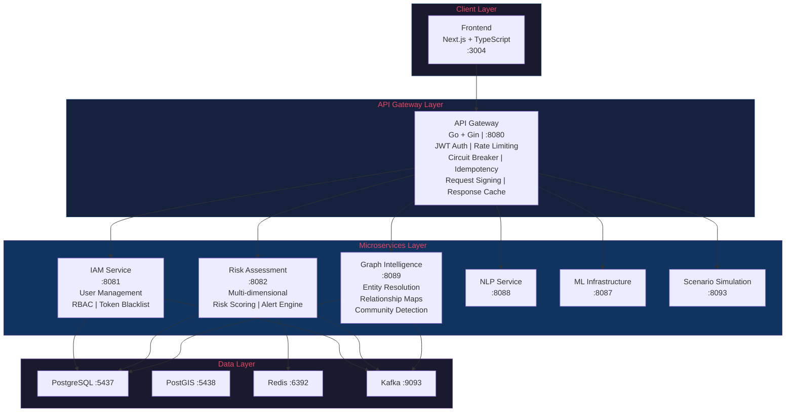
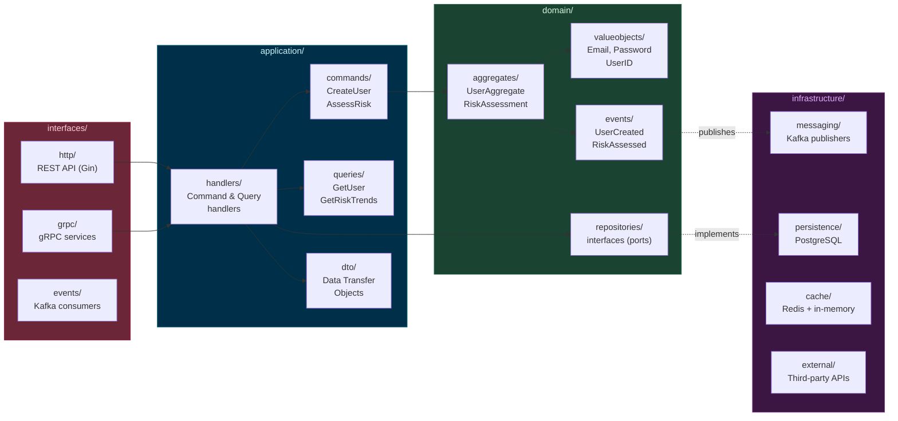
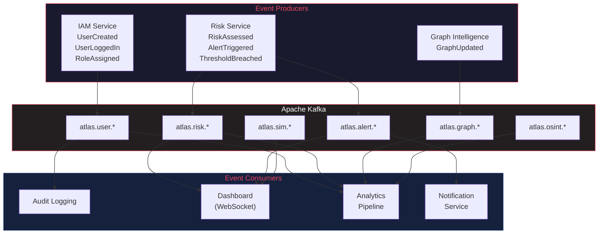
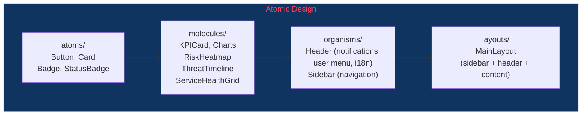
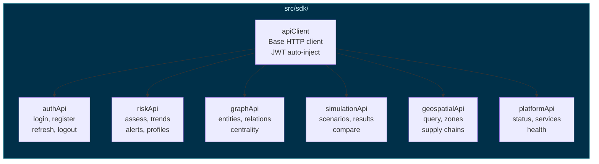
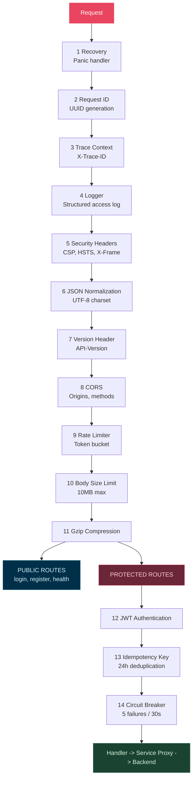
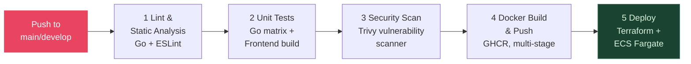

<div align="center">


# ATLAS Core API

### Plataforma de Inteligencia Estrategica

**Cloud-Native | DDD + CQRS | Event-Driven | Enterprise-Grade**

[]()
[]()
[]()
[]()
[]()
[]()

[]()
[]()
[]()
[]()
[]()
[]()
[]()

**29 Microservicios** | **150+ Endpoints de API** | **35+ Contenedores Docker** | **3 Idiomas (i18n)**

[Inicio Rapido](#inicio-rapido) | [Arquitectura](#arquitectura) | [Manual de API](docs/API_MANUAL.md) | [Contribuir](#contribuir)

**[English](README.md)** | **[Portugues (BR)](README.pt-BR.md)**

</div>

---

## Tabla de Contenidos

- [Vision General](#vision-general)
- [Arquitectura](#arquitectura)
  - [Diseno del Sistema](#vision-general-del-sistema)
  - [Arquitectura DDD + CQRS](#arquitectura-ddd--cqrs)
  - [Arquitectura Orientada a Eventos](#arquitectura-orientada-a-eventos)
  - [Stack Tecnologico](#stack-tecnologico)
- [Aplicacion Frontend](#aplicacion-frontend)
- [Funcionalidades Empresariales](#funcionalidades-empresariales)
- [Primeros Pasos](#primeros-pasos)
- [Referencia de API](#referencia-de-api)
- [Autenticacion y Autorizacion](#autenticacion--autorizacion)
- [Catalogo de Eventos](#catalogo-de-eventos)
- [Registro de Servicios](#registro-de-servicios)
- [Esquema de Base de Datos](#esquema-de-base-de-datos)
- [Pipeline de Middleware](#pipeline-de-middleware)
- [Observabilidad](#observabilidad)
- [Infraestructura y DevOps](#infraestructura--devops)
- [Referencia de Configuracion](#referencia-de-configuracion)
- [Estructura del Proyecto](#estructura-del-proyecto)
- [Solucion de Problemas](#solucion-de-problemas)
- [Hoja de Ruta](#hoja-de-ruta)
- [Contribuir](#contribuir)
- [Licencia](#licencia)

> **Manual de API**: Para la referencia completa de endpoints con ejemplos de solicitud/respuesta, consulte [docs/API_MANUAL.md](docs/API_MANUAL.md).

---

## Vision General

ATLAS es una **Plataforma de Inteligencia Estrategica** de grado empresarial construida para organizaciones que requieren analisis de riesgos estrategicos, simulacion de escenarios, inteligencia geoespacial y soporte de decisiones en tiempo casi real. Arquitectada con patrones de **Domain-Driven Design (DDD)**, **CQRS** y **Arquitectura Orientada a Eventos** a traves de 29 microservicios cloud-native, proporciona:

- **Analisis de Riesgos Multidimensional** a traves de dimensiones Operativas, Financieras, Reputacionales, Geopoliticas y de Cumplimiento
- **Pipeline de Machine Learning** con seguimiento de experimentos MLflow, servicio de modelos, monitoreo de deriva y explicabilidad (XAI)
- **Procesamiento de Lenguaje Natural** para reconocimiento de entidades, analisis de sentimiento, clasificacion y resumen de documentos
- **Inteligencia de Grafos** impulsada por mapeo de relaciones, analisis de centralidad, deteccion de comunidades y propagacion de riesgos
- **Simulacion de Escenarios** con metodos Monte Carlo y modelado basado en agentes
- **Gemelos Digitales** de infraestructura, cadena de suministro y sistemas economicos
- **Inteligencia Geoespacial** con consultas espaciales respaldadas por PostGIS y mapeo de cadenas de suministro
- **Cumplimiento Automatizado** con Policy-as-Code, auditoria continua y generacion de evidencia
- **Recopilacion OSINT** agregando inteligencia de fuentes abiertas de noticias, datos legales y fuentes con licencia

---

## Arquitectura

### Vision General del Sistema



### Stack Tecnologico

| Capa               | Tecnologia                                                     |
|--------------------|----------------------------------------------------------------|
| **API Gateway**    | Go 1.21, Gin, JWT, Circuit Breaker, Rate Limiter               |
| **Backend**        | Go (Gin), Python (FastAPI)                                     |
| **Frontend**       | Next.js 14, TypeScript, Tailwind CSS                           |
| **BD Principal**   | PostgreSQL 15 (Alpine) con connection pooling                  |
| **BD Geoespacial** | PostGIS 15-3.3 (Alpine)                                        |
| **Cache**          | Redis 7 (Alpine) con eviccion LRU, persistencia AOF           |
| **Mensajeria**     | Apache Kafka (Confluent 7.5) con Zookeeper                    |
| **ML/IA**          | MLflow, XGBoost, LSTM, Transformers                            |
| **Observabilidad** | Prometheus, OpenTelemetry (OTLP/gRPC), Logging JSON Estructurado |
| **Infraestructura**| Docker, Docker Compose, builds Alpine multi-etapa              |

### Principios de Diseno

- **Domain-Driven Design**: Contextos delimitados con agregados, objetos de valor y eventos de dominio
- **CQRS**: Segregacion de Responsabilidad de Comandos y Consultas para optimizacion de escritura/lectura
- **Orientado a Eventos**: Streaming de eventos basado en Kafka a traves de todos los contextos delimitados
- **Registro de Servicios por Configuracion**: 29 servicios backend registrados mediante variables de entorno
- **Patron Circuit Breaker**: Sony gobreaker protegiendo toda la comunicacion entre servicios
- **Degradacion Elegante**: Cache en memoria como respaldo cuando Redis no esta disponible
- **Seguridad Zero-Trust**: Capas de JWT + API Key + firma de solicitudes HMAC
- **Contenedores Sin Root**: Todas las imagenes Docker se ejecutan como `appuser` sin privilegios (uid 1000)
- **Arquitectura Limpia**: `cmd/` > `interfaces/` > `application/` > `domain/` > `infrastructure/`

### Arquitectura DDD + CQRS

Cada microservicio Go sigue Domain-Driven Design con separacion CQRS:



### Arquitectura Orientada a Eventos

Todos los eventos de dominio fluyen a traves de Kafka con sobres estructurados:



**Formato del Sobre de Eventos:**
```json
{
  "event_id": "uuid-v4",
  "event_type": "atlas.risk.assessed",
  "aggregate_id": "entity-uuid",
  "timestamp": "2024-01-15T10:30:00Z",
  "version": 1,
  "source": "risk-assessment",
  "payload": { ... }
}
```

---

## Aplicacion Frontend

El frontend de ATLAS es un dashboard Next.js 14 construido con TypeScript, Tailwind CSS y Recharts. Proporciona una interfaz completa de inteligencia estrategica con diseno de tema oscuro.

### Paginas y Funcionalidades

| Pagina | Ruta | Descripcion |
|--------|------|-------------|
| **Centro de Comando** | `/dashboard` | Monitoreo de amenazas en tiempo real con barra de KPIs, graficos de tendencia de incidentes, panel de estado del sistema, alertas activas con filtrado por severidad/categoria, modales de detalle de alertas y controles de actualizacion automatica |
| **Analitica** | `/analytics` | Analisis multidimensional de amenazas con 3 pestanas (Vision General, Tendencias, Desglose), graficos de area/barras/pastel/radar, filtrado por rango de tiempo, exportacion CSV/JSON |
| **Geoespacial** | `/geospatial` | Mapa mundial interactivo con 6 capas configurables (infraestructura, energia, cadena de suministro, maritimo, zonas de riesgo, satelites), marcadores de activos, controles de opacidad de capas, modos 2D/3D/satelite, reproduccion de linea de tiempo |
| **Simulaciones** | `/simulations` | Asistente de escenarios multi-paso con 6+ plantillas, configuracion de parametros, ejecucion Monte Carlo con progreso en tiempo real, analisis de impacto en 7 dimensiones, visualizacion de linea de tiempo, recomendaciones estrategicas |
| **Cumplimiento** | `/compliance` | Seguimiento regulatorio para GDPR, LGPD, SOC 2, ISO 27001, tabla de registros de auditoria, politicas de gobernanza de datos (cifrado, retencion, control de acceso) |
| **Inicio de Sesion** | `/login` | Autenticacion segura con validacion de formularios, manejo de errores, credenciales de demostracion |

### Stack Tecnologico del Frontend

| Capa | Tecnologia |
|------|------------|
| **Framework** | Next.js 14 (App Router) |
| **Lenguaje** | TypeScript 5.5 |
| **Estilos** | Tailwind CSS 3.4 |
| **Estado** | Zustand 4.5 (stores de auth, UI, dashboard, mapa, plataforma, amenazas, simulacion, geo) |
| **Estado del Servidor** | TanStack React Query 5.5 |
| **Graficos** | Recharts 2.12 |
| **Animaciones** | Framer Motion 11.3 |
| **Fechas** | date-fns 3.6 |

### Internacionalizacion (i18n)

Soporte multiidioma completo con deteccion automatica del navegador y preferencias persistentes:

| Idioma | Locale | Estado |
|--------|--------|--------|
| Ingles | `en` | Completo (predeterminado) |
| Portugues (Brasil) | `pt-BR` | Completo |
| Espanol | `es` | Completo |

- Sistema de traduccion basado en contexto con hook `useI18n()` y funcion `t()`
- Soporte de claves anidadas (ej., `t("dashboard.alerts.criticalInfra")`)
- Selector de idioma en el encabezado con indicadores de bandera
- Persistencia en LocalStorage (clave `atlas-locale`)
- Respaldo a ingles para claves faltantes
- Las 5 paginas de la aplicacion completamente internacionalizadas

### Arquitectura de Componentes



### Gestion de Estado (Stores de Zustand)

| Store | Proposito |
|-------|-----------|
| `useAuthStore` | Sesion de usuario, estado de autenticacion (persistido en localStorage) |
| `useUIStore` | Toggle de barra lateral, tema, notificaciones |
| `useDashboardStore` | Rango de tiempo, filtros de nivel de riesgo, intervalo de actualizacion |
| `useMapStore` | Viewport del mapa, capas visibles, caracteristica seleccionada |
| `usePlatformStore` | Estado de salud de servicios, ultima verificacion de salud |
| `useThreatStore` | Gestion de eventos de amenazas, filtrado por severidad, reconocimiento |
| `useSimulationStore` | Ejecuciones de simulacion, seguimiento de progreso, estado de ejecucion activa |
| `useGeoStore` | Viewport del mapa, controles de capas, seleccion de caracteristicas, modo de mapa |

### SDK de API Tipado



### Hooks Personalizados

| Hook | Proposito |
|------|-----------|
| `useAlerts` | Gestion de alertas con filtrado, reconocimiento, investigacion, descarte |
| `useAutoRefresh` | Actualizacion automatica configurable con cuenta regresiva y activacion manual |
| `useAuth` | Contexto de autenticacion (login, logout, estado del usuario) |
| `useI18n` | Funcion de traduccion y gestion de locale |

---

## Funcionalidades Empresariales

### Autenticacion y Seguridad

| Funcionalidad              | Descripcion                                                         |
|----------------------------|---------------------------------------------------------------------|
| Autenticacion JWT          | Tokens firmados con HMAC-SHA256 con expiracion configurable (1h por defecto) |
| Rotacion de Refresh Token  | Renovacion segura de tokens con refresh tokens de 7 dias            |
| Lista Negra de Tokens      | Lista negra en memoria con limpieza en segundo plano (intervalos de 30 min) |
| Autenticacion por API Key  | Claves hasheadas con SHA256 con scopes, limites de tasa y listas de IPs permitidas |
| Firma de Solicitudes HMAC  | `X-Request-Signature` con proteccion de ventana de replay de 5 minutos |
| Soporte MFA                | Autenticacion multi-factor opcional basada en TOTP                  |
| Bloqueo de Cuenta          | Intentos maximos configurables (5 por defecto) con duracion de bloqueo (15m) |
| RBAC                       | Control de acceso basado en roles (admin, analyst, viewer, operator) |
| Sistema de Permisos        | Permisos granulares recurso:accion con soporte de comodines         |
| Politica de Contrasenas    | Longitud minima, requisitos de caracteres especiales                |

### Resiliencia y Rendimiento

| Funcionalidad          | Descripcion                                                            |
|------------------------|------------------------------------------------------------------------|
| Circuit Breaker        | Circuit breakers por servicio via Sony gobreaker (5 fallos max, 30s)   |
| Limitacion de Tasa     | RPS configurable (100/s por defecto) + modo estricto (20/min) para sensibles |
| Cache de Respuestas    | Cache de respuestas GET con clave SHA256 y backend Redis               |
| Claves de Idempotencia | Deduplicacion de 24 horas para POST/PUT/PATCH via header `Idempotency-Key` |
| Connection Pooling     | HTTP: 100 max idle / 10 por host. PostgreSQL: 25 abiertas / 10 idle   |
| Limite de Tamano        | 10MB max de cuerpo de solicitud con `http.MaxBytesReader`             |
| Compresion Gzip        | Compresion automatica de respuestas via `gin-contrib/gzip`             |
| Apagado Elegante       | Timeout configurable (30s por defecto) con drenado concurrente de servidor |

### Observabilidad

| Funcionalidad        | Descripcion                                                     |
|----------------------|-----------------------------------------------------------------|
| Metricas Prometheus  | Duracion de solicitudes HTTP, codigos de estado, tamanos de respuesta en `:9090` |
| OpenTelemetry        | Rastreo distribuido via OTLP/gRPC (reemplaza Jaeger deprecado) |
| Logging Estructurado | Logs JSON via `zap` con correlacion de request ID               |
| Rastreo de Solicitudes | Propagacion de `X-Request-ID` + `X-Trace-ID` entre servicios |
| Verificaciones de Salud | `/health`, `/healthz` (liveness), `/readyz` (readiness)      |
| Logging de Acceso    | Log completo de acceso HTTP con latencia, estado, tamanos       |

### Middleware Empresarial

| Funcionalidad        | Descripcion                                                      |
|----------------------|------------------------------------------------------------------|
| Cabeceras de Seguridad | X-Frame-Options, CSP, HSTS, Permissions-Policy, Referrer-Policy |
| CORS                 | Origenes, metodos, cabeceras, credenciales configurables         |
| Versionado de API    | Cabeceras de respuesta `API-Version` + `X-API-Version`           |
| Avisos de Deprecacion | Cabeceras `Sunset` + `Deprecation` para endpoints deprecados    |
| Endpoints Sensibles  | Logging mejorado + desactivacion de cache para operaciones sensibles |
| Timeout de Solicitud | Cabeceras de timeout configurables por solicitud                 |
| Normalizacion JSON   | Enforcement de charset UTF-8 en todas las respuestas             |

---

## Primeros Pasos

### Prerrequisitos

- Docker Desktop (Windows/Mac) o Docker Engine + Compose (Linux)
- Git
- Minimo 8GB RAM, 20GB de espacio libre en disco
- Go 1.21+ (solo para desarrollo local)

### Inicio Rapido

```bash
# Clonar el repositorio
git clone https://github.com/your-org/atlas-core-api.git
cd atlas-core-api

# Configurar el entorno
cp .env.example .env
# Edite .env con sus credenciales (cambie JWT_SECRET para produccion)

# Iniciar todos los servicios
docker compose up --build
```

### Endpoints de Servicios

| Servicio             | URL                          | Descripcion              |
|----------------------|------------------------------|--------------------------|
| Frontend             | `http://localhost:3004`      | Dashboard Next.js        |
| API Gateway          | `http://localhost:8080`      | Punto de entrada principal de la API |
| Servicio IAM         | `http://localhost:8084`      | Gestion de identidad     |
| Evaluacion de Riesgos | `http://localhost:8086`     | Motor de puntuacion de riesgos |
| Inteligencia de Grafos | `http://localhost:8089`    | Analisis de relaciones   |
| Metricas Prometheus  | `http://localhost:9090`      | Metricas del gateway     |
| PostgreSQL           | `localhost:5437`             | Base de datos principal  |
| PostGIS              | `localhost:5438`             | Base de datos geoespacial |
| Redis                | `localhost:6392`             | Cache y sesiones         |
| Kafka                | `localhost:9093`             | Streaming de eventos     |
| Zookeeper            | `localhost:2181`             | Coordinacion de Kafka    |

### Verificacion de Salud

```bash
# Salud del gateway
curl http://localhost:8080/health

# Sonda de liveness (compatible con Kubernetes)
curl http://localhost:8080/healthz

# Sonda de readiness
curl http://localhost:8080/readyz
```

---

## Referencia de API

> **Manual Completo de API**: Para la referencia completa de endpoints con ejemplos de solicitud/respuesta, muestras de SDK (cURL, JavaScript, Python) y guia de integracion, consulte **[docs/API_MANUAL.md](docs/API_MANUAL.md)**.

**URL Base**: `http://localhost:8080/api/v1`

Todos los endpoints protegidos requieren:
```
Authorization: Bearer <jwt_token>
```

### Autenticacion

| Metodo | Endpoint               | Auth     | Descripcion                    |
|--------|------------------------|----------|--------------------------------|
| POST   | `/auth/login`          | Publico  | Iniciar sesion con usuario/contrasena |
| POST   | `/auth/register`       | Publico  | Registrar nueva cuenta de usuario |
| POST   | `/auth/refresh`        | Publico  | Renovar token de acceso        |
| GET    | `/auth/validate`       | Publico  | Validar token                  |
| POST   | `/auth/logout`         | Bearer   | Cerrar sesion (invalida token) |
| POST   | `/auth/change-password`| Bearer   | Cambiar contrasena (sensible)  |

#### Iniciar Sesion

```bash
curl -X POST http://localhost:8080/api/v1/auth/login \
  -H "Content-Type: application/json" \
  -d '{"username": "admin", "password": "Admin@2024"}'
```

> **Credenciales de Demostracion**: `admin` / `Admin@2024` (la contrasena debe tener 8+ caracteres)

Respuesta:
```json
{
  "access_token": "eyJhbGciOiJIUzI1NiIs...",
  "refresh_token": "eyJhbGciOiJIUzI1NiIs...",
  "token_type": "Bearer",
  "expires_in": 3600,
  "user": {
    "id": "uuid",
    "username": "admin",
    "email": "admin@atlas.com",
    "roles": ["admin"]
  }
}
```

#### Registrar

```bash
curl -X POST http://localhost:8080/api/v1/auth/register \
  -H "Content-Type: application/json" \
  -d '{
    "username": "analyst01",
    "email": "analyst@atlas.com",
    "password": "SecurePass!123"
  }'
```

### Gestion de Usuarios

| Metodo | Endpoint                       | Auth   | Descripcion                |
|--------|--------------------------------|--------|----------------------------|
| GET    | `/users/me`                    | Bearer | Obtener perfil del usuario actual |
| GET    | `/users/:id`                   | Bearer | Obtener usuario por ID     |
| PUT    | `/users/:id`                   | Bearer | Actualizar usuario (propio o admin) |
| DELETE | `/users/:id`                   | Admin  | Eliminar usuario           |
| GET    | `/admin/users`                 | Admin  | Listar todos los usuarios (paginado) |

### Gestion de Roles (Admin)

| Metodo | Endpoint                       | Auth  | Descripcion                |
|--------|--------------------------------|-------|----------------------------|
| GET    | `/admin/roles`                 | Admin | Listar todos los roles     |
| POST   | `/admin/roles`                 | Admin | Crear nuevo rol            |
| POST   | `/admin/users/:id/roles/:roleId`  | Admin | Asignar rol a usuario  |
| DELETE | `/admin/users/:id/roles/:roleId`  | Admin | Eliminar rol de usuario |

### Ingestion de Datos

| Metodo | Endpoint                         | Descripcion                  |
|--------|----------------------------------|------------------------------|
| GET    | `/ingestion/sources`             | Listar fuentes de datos      |
| POST   | `/ingestion/sources`             | Crear nueva fuente           |
| GET    | `/ingestion/sources/:id`         | Detalles de la fuente        |
| POST   | `/ingestion/sources/:id/data`    | Enviar datos para ingestion  |
| POST   | `/ingestion/sources/:id/trigger` | Activar ingestion manual     |
| GET    | `/ingestion/status`              | Estado general de ingestion  |

### Normalizacion de Datos

| Metodo | Endpoint                           | Descripcion             |
|--------|------------------------------------|-------------------------|
| GET    | `/normalization/rules`             | Listar reglas de normalizacion |
| POST   | `/normalization/rules`             | Crear regla             |
| GET    | `/normalization/rules/:id`         | Detalles de la regla    |
| PUT    | `/normalization/rules/:id`         | Actualizar regla        |
| DELETE | `/normalization/rules/:id`         | Eliminar regla          |
| GET    | `/normalization/quality/:data_id`  | Metricas de calidad del dataset |
| GET    | `/normalization/stats`             | Estadisticas agregadas  |

### Evaluacion de Riesgos

| Metodo | Endpoint                       | Descripcion                   |
|--------|--------------------------------|-------------------------------|
| POST   | `/risks/assess`                | Evaluar riesgo de entidad     |
| GET    | `/risks/:id`                   | Obtener evaluacion especifica |
| GET    | `/risks/trends`                | Tendencias de riesgo en el tiempo |
| GET    | `/risks/entities/:entity_id`   | Evaluaciones por entidad      |
| POST   | `/risks/alerts`                | Configurar alertas de riesgo  |
| GET    | `/risks/profiles`              | Perfiles ejecutivos de riesgo |

### Auditoria y Cumplimiento

| Metodo | Endpoint                       | Descripcion                |
|--------|--------------------------------|----------------------------|
| POST   | `/audit/events`                | Crear evento de auditoria  |
| GET    | `/audit/logs`                  | Listar registros de auditoria |
| GET    | `/audit/logs/:id`              | Detalles del registro      |
| GET    | `/audit/compliance/report`     | Reporte de cumplimiento    |
| GET    | `/compliance/status`           | Cumplimiento consolidado   |
| GET    | `/compliance/lineage/:id`      | Seguimiento de linaje de datos |

### Infraestructura ML

| Metodo | Endpoint                          | Descripcion             |
|--------|-----------------------------------|-------------------------|
| GET    | `/ml/models`                      | Listar modelos registrados |
| POST   | `/ml/models`                      | Registrar modelo        |
| POST   | `/ml/models/:model_name/predict`  | Ejecutar prediccion     |
| GET    | `/ml/experiments`                 | Listar experimentos     |
| GET    | `/ml/health`                      | Salud de infraestructura ML |

### Servicios NLP

| Metodo | Endpoint              | Descripcion                  |
|--------|-----------------------|------------------------------|
| POST   | `/nlp/ner`            | Reconocimiento de Entidades Nombradas |
| POST   | `/nlp/sentiment`      | Analisis de sentimiento      |
| POST   | `/nlp/classify`       | Clasificacion de texto       |
| POST   | `/nlp/summarize`      | Resumen de documentos        |

### Inteligencia de Grafos

| Metodo | Endpoint                                | Descripcion              |
|--------|-----------------------------------------|--------------------------|
| POST   | `/graph/entities/resolve`               | Resolucion de entidades  |
| GET    | `/graph/entities/:id/relationships`     | Relaciones de entidad    |
| GET    | `/graph/entities/:id/risk-propagation`  | Rutas de propagacion de riesgos |
| GET    | `/graph/analytics/centrality`           | Analisis de centralidad  |
| GET    | `/graph/analytics/communities`          | Deteccion de comunidades |

### Inteligencia Geoespacial

| Metodo | Endpoint                        | Descripcion             |
|--------|---------------------------------|-------------------------|
| POST   | `/geospatial/query`             | Consulta espacial       |
| GET    | `/geospatial/zones`             | Listado de zonas/capas  |
| POST   | `/geospatial/context`           | Contexto de ubicacion   |
| GET    | `/geospatial/supply-chains`     | Mapas de cadena de suministro |
| POST   | `/geospatial/supply-chains`     | Crear mapa de cadena de suministro |

### OSINT y Noticias

| Metodo | Endpoint              | Descripcion                |
|--------|-----------------------|----------------------------|
| GET    | `/osint/analysis`     | Analisis OSINT             |
| GET    | `/osint/signals`      | Senales de inteligencia    |
| GET    | `/news/articles`      | Articulos de noticias agregados |
| GET    | `/news/sources`       | Fuentes de noticias        |
| POST   | `/briefings/generate` | Generar informe ejecutivo  |

### Simulacion de Escenarios

| Metodo | Endpoint                              | Descripcion             |
|--------|---------------------------------------|-------------------------|
| POST   | `/simulations/scenarios`              | Crear escenario         |
| GET    | `/simulations/:simulation_id`         | Obtener resultados de simulacion |
| GET    | `/simulations/:simulation_id/results` | Resultados detallados   |
| POST   | `/simulations/compare`                | Comparar escenarios     |

### Endpoints Empresariales

| Area             | Metodo | Endpoint                        | Descripcion                |
|------------------|--------|---------------------------------|----------------------------|
| XAI              | POST   | `/xai/explain`                  | Explicar decision del modelo |
| XAI              | POST   | `/xai/batch`                    | Explicaciones por lote     |
| War-Gaming       | POST   | `/wargaming/scenarios`          | Crear escenario de war-game |
| Digital Twins    | GET    | `/twins`                        | Listar gemelos digitales   |
| Digital Twins    | POST   | `/twins`                        | Crear gemelo digital       |
| Policy Impact    | POST   | `/policy/analyze`               | Analisis de impacto de politicas |
| Multi-Region     | GET    | `/regions`                      | Listar regiones            |
| Data Residency   | GET    | `/residency/policies`           | Politicas de residencia de datos |
| Federated ML     | POST   | `/federated/training/start`     | Iniciar entrenamiento federado |
| Mobile API       | GET    | `/mobile/dashboard`             | Datos del dashboard movil  |
| Compliance       | GET    | `/compliance/automation/status` | Estado de automatizacion   |

### Estado de la Plataforma

| Metodo | Endpoint                  | Descripcion                           |
|--------|---------------------------|---------------------------------------|
| GET    | `/platform/status`        | Estado agregado de todos los servicios |
| GET    | `/platform/services`      | Listar servicios registrados          |

### Idempotencia

Para operaciones de mutacion (POST, PUT, PATCH), incluya una clave de idempotencia:

```bash
curl -X POST http://localhost:8080/api/v1/risks/assess \
  -H "Authorization: Bearer <token>" \
  -H "Idempotency-Key: unique-request-id-123" \
  -H "Content-Type: application/json" \
  -d '{"entity_id": "...", "entity_type": "organization"}'
```

Las respuestas repetidas incluyen `X-Idempotent-Replayed: true`.

---

## Autenticacion y Autorizacion

### Estructura del Token JWT

```json
{
  "user_id": "uuid",
  "username": "admin",
  "email": "admin@atlas.com",
  "roles": ["admin"],
  "permissions": ["risk:read", "risk:write", "user:manage"],
  "mfa_verified": false,
  "exp": 1700000000,
  "iat": 1699996400
}
```

### Roles Predeterminados

| Rol        | Descripcion                             |
|------------|-----------------------------------------|
| `admin`    | Acceso completo al sistema, gestion de usuarios |
| `analyst`  | Acceso de lectura/escritura a funciones de analisis |
| `viewer`   | Acceso de solo lectura                  |
| `operator` | Acceso de gestion operativa             |

### Permisos Predeterminados

| Permiso                 | Recurso       | Accion |
|-------------------------|---------------|--------|
| `risk:read`             | risk          | read   |
| `risk:write`            | risk          | write  |
| `user:read`             | user          | read   |
| `user:manage`           | user          | manage |
| `audit:read`            | audit         | read   |
| `data:ingest`           | data          | ingest |
| `model:predict`         | model         | predict|

### Autenticacion por API Key

Para comunicacion servicio a servicio:

```bash
curl http://localhost:8080/api/v1/risks/trends \
  -H "X-API-Key: your-api-key-here"
```

### Firma de Solicitudes HMAC

Para endpoints de alta seguridad:

```bash
# Signature = HMAC-SHA256(secret, "{timestamp}.{path}.{body}")
curl http://localhost:8080/api/v1/risks/assess \
  -H "X-Request-Signature: <hmac-signature>" \
  -H "X-Request-Timestamp: <unix-timestamp>"
```

---

## Registro de Servicios

El API Gateway redirige las solicitudes a 29 servicios backend a traves de un registro configurado. Cada URL de servicio es configurable mediante variables de entorno.

| Servicio                     | URL Interna                            | Variable de Entorno                       |
|------------------------------|----------------------------------------|-------------------------------------------|
| Servicio IAM                 | `http://iam-service:8081`              | `SERVICE_IAM_SERVICE_URL`                 |
| Evaluacion de Riesgos        | `http://risk-assessment:8082`          | `SERVICE_RISK_ASSESSMENT_URL`             |
| Agregador de Noticias        | `http://news-aggregator:8083`          | `SERVICE_NEWS_AGGREGATOR_URL`             |
| Servicio de Ingestion        | `http://ingestion-service:8084`        | `SERVICE_INGESTION_SERVICE_URL`           |
| Servicio de Normalizacion    | `http://normalization-service:8085`    | `SERVICE_NORMALIZATION_SERVICE_URL`       |
| Servicio de Auditoria        | `http://audit-logging:8086`            | `SERVICE_AUDIT_SERVICE_URL`              |
| Infraestructura ML           | `http://ml-infrastructure:8087`        | `SERVICE_ML_INFRASTRUCTURE_URL`           |
| Servicio NLP                 | `http://nlp-service:8088`              | `SERVICE_NLP_SERVICE_URL`                 |
| Inteligencia de Grafos       | `http://graph-intelligence:8089`       | `SERVICE_GRAPH_INTELLIGENCE_URL`          |
| Servicio XAI                 | `http://xai-service:8090`              | `SERVICE_XAI_SERVICE_URL`                 |
| Servicio de Modelos          | `http://model-serving:8091`            | `SERVICE_MODEL_SERVING_URL`               |
| Monitoreo de Modelos         | `http://model-monitoring:8092`         | `SERVICE_MODEL_MONITORING_URL`            |
| Simulacion de Escenarios     | `http://scenario-simulation:8093`      | `SERVICE_SCENARIO_SIMULATION_URL`         |
| War-Gaming                   | `http://war-gaming:8094`               | `SERVICE_WAR_GAMING_URL`                  |
| Gemelos Digitales            | `http://digital-twins:8095`            | `SERVICE_DIGITAL_TWINS_URL`               |
| Impacto de Politicas         | `http://policy-impact:8096`            | `SERVICE_POLICY_IMPACT_URL`               |
| Multi-Region                 | `http://multi-region:8097`             | `SERVICE_MULTI_REGION_URL`                |
| Residencia de Datos          | `http://data-residency:8098`           | `SERVICE_DATA_RESIDENCY_URL`              |
| Aprendizaje Federado         | `http://federated-learning:8099`       | `SERVICE_FEDERATED_LEARNING_URL`          |
| API Movil                    | `http://mobile-api:8100`               | `SERVICE_MOBILE_API_URL`                  |
| Automatizacion de Cumplimiento | `http://compliance-automation:8101`  | `SERVICE_COMPLIANCE_AUTOMATION_URL`       |
| Optimizacion de Rendimiento  | `http://performance-optimization:8102` | `SERVICE_PERFORMANCE_OPTIMIZATION_URL`    |
| Optimizacion de Costos       | `http://cost-optimization:8103`        | `SERVICE_COST_OPTIMIZATION_URL`           |
| I+D Avanzado                 | `http://advanced-rd:8104`              | `SERVICE_ADVANCED_RD_URL`                 |
| Certificacion de Seguridad   | `http://security-certification:8105`   | `SERVICE_SECURITY_CERTIFICATION_URL`      |
| Mejora Continua              | `http://continuous-improvement:8106`   | `SERVICE_CONTINUOUS_IMPROVEMENT_URL`      |
| Servicio de Entidades        | `http://entity-service:8107`           | `SERVICE_ENTITY_SERVICE_URL`              |
| Servicio Geoespacial         | `http://geospatial-service:8108`       | `SERVICE_GEOSPATIAL_SERVICE_URL`          |
| Servicio de Inteligencia     | `http://intelligence-service:8109`     | `SERVICE_INTELLIGENCE_SERVICE_URL`        |

---

## Esquema de Base de Datos

### Tablas Principales (Migracion 000001)

```sql
-- IAM
users (id UUID PK, username UNIQUE, email UNIQUE, password_hash, is_active, is_verified, last_login_at)
roles (id UUID PK, name UNIQUE, description)
permissions (id UUID PK, name UNIQUE, resource, action, description)
user_roles (user_id FK, role_id FK, composite PK)
role_permissions (role_id FK, permission_id FK)

-- Risk Assessment
risk_assessments (id UUID PK, entity_id, entity_type, overall_score, operational_score,
                  financial_score, reputational_score, geopolitical_score, compliance_score)
risk_alerts (id UUID PK, assessment_id FK, severity ENUM, is_resolved, resolved_by)

-- Audit & Compliance
audit_logs (id UUID PK, user_id, action, resource, resource_id, ip_address, user_agent, details JSONB)
compliance_events (id UUID PK, event_type, regulation, status, evidence JSONB)

-- Data Ingestion
data_sources (id UUID PK, name UNIQUE, source_type, config JSONB, is_active)
ingestion_runs (id UUID PK, source_id FK, status, records_processed, records_failed, error_message)
```

### Tablas Empresariales (Migracion 000003)

```sql
-- API Key Management
api_keys (id UUID PK, key_hash UNIQUE, key_prefix, owner_id FK, scopes TEXT[],
          rate_limit_rps, allowed_ips TEXT[], expires_at)

-- Token & Session Management
token_blacklist (id UUID PK, token_hash, user_id FK, reason, expires_at)
login_attempts (id UUID PK, username, ip_address, success BOOL, user_agent, failure_reason)
user_sessions (id UUID PK, user_id FK, token_hash, ip_address, device_info JSONB, expires_at)

-- Webhook System
webhook_subscriptions (id UUID PK, url, secret, events TEXT[], owner_id FK, retry_count, timeout_seconds)
webhook_deliveries (id UUID PK, subscription_id FK, event_type, payload JSONB, response_status, success)

-- Feature Flags
feature_flags (id UUID PK, name UNIQUE, is_enabled, rules JSONB, rollout_percentage 0-100, created_by FK)
```

### Tablas Geoespaciales (Migracion 000002)

Tablas habilitadas con PostGIS para consultas espaciales, gestion de zonas y mapeo geografico de cadenas de suministro.

### Datos Iniciales

La migracion inicial incluye:
- **4 roles**: admin, analyst, viewer, operator
- **7 permisos**: risk:read, risk:write, user:read, user:manage, audit:read, data:ingest, model:predict
- **Usuario admin**: `admin` / `admin@atlas.com`

---

## Pipeline de Middleware

Las solicitudes fluyen a traves de la siguiente cadena de middleware en orden:



---

## Observabilidad

### Metricas Prometheus

Disponibles en `http://localhost:9090/metrics`:

- `http_requests_total` - Total de solicitudes HTTP por metodo, ruta, estado
- `http_request_duration_seconds` - Histograma de latencia de solicitudes
- `http_response_size_bytes` - Histograma de tamano de respuestas

### Logging Estructurado

Todos los servicios usan `zap` para logging JSON estructurado:

```json
{
  "level": "info",
  "msg": "HTTP Request",
  "method": "POST",
  "path": "/api/v1/auth/login",
  "status": 200,
  "latency": "12.345ms",
  "ip": "172.28.0.1",
  "request_id": "550e8400-e29b-41d4-a716-446655440000",
  "request_size": 64,
  "response_size": 512
}
```

### Rastreo Distribuido

OpenTelemetry con exportador OTLP/gRPC (configurable):

```bash
TRACING_ENABLED=true
JAEGER_ENDPOINT=localhost:4317  # OTLP gRPC endpoint
TRACING_SAMPLING_FRACTION=0.1
```

### Verificaciones de Salud

Cada servicio implementa verificaciones de salud Docker:

| Endpoint   | Proposito                              |
|------------|----------------------------------------|
| `/health`  | Salud completa con verificacion de dependencias |
| `/healthz` | Sonda de liveness de Kubernetes        |
| `/readyz`  | Sonda de readiness de Kubernetes       |

---

## Referencia de Configuracion

Toda la configuracion se gestiona mediante variables de entorno. Consulte `.env.example` para la referencia completa.

### Configuraciones Criticas

| Variable              | Predeterminado             | Descripcion                          |
|-----------------------|--------------------------|--------------------------------------|
| `ENVIRONMENT`         | `development`            | Entorno (development/production)     |
| `JWT_SECRET`          | `change-me-in-production`| **Debe cambiarse en produccion**     |
| `POSTGRES_PASSWORD`   | `atlas_dev`              | Contrasena de la base de datos       |
| `SERVER_PORT`         | `8080`                   | Puerto del API Gateway               |

### Servidor

| Variable                  | Predeterminado | Descripcion            |
|---------------------------|---------|------------------------|
| `SERVER_HOST`             | `0.0.0.0` | Direccion de enlace |
| `SERVER_READ_TIMEOUT`     | `30s`   | Timeout de lectura     |
| `SERVER_WRITE_TIMEOUT`    | `30s`   | Timeout de escritura   |
| `SERVER_IDLE_TIMEOUT`     | `120s`  | Timeout de inactividad |
| `SERVER_SHUTDOWN_TIMEOUT` | `30s`   | Apagado elegante       |
| `SERVER_GRACEFUL_SHUTDOWN`| `true`  | Habilitar apagado elegante |

### Autenticacion

| Variable                   | Predeterminado | Descripcion                |
|----------------------------|---------|----------------------------|
| `JWT_EXPIRATION`           | `15m`   | TTL del token de acceso    |
| `REFRESH_TOKEN_EXPIRATION` | `168h`  | TTL del refresh token (7 dias) |
| `MAX_LOGIN_ATTEMPTS`       | `5`     | Max intentos fallidos de login |
| `LOCKOUT_DURATION`         | `15m`   | Duracion del bloqueo de cuenta |
| `PASSWORD_MIN_LENGTH`      | `8`     | Longitud minima de contrasena |
| `PASSWORD_REQUIRE_SPECIAL` | `true`  | Requerir caracteres especiales |
| `MFA_REQUIRED`             | `false` | Forzar MFA                 |

### Cache

| Variable              | Predeterminado             | Descripcion              |
|-----------------------|--------------------------|--------------------------|
| `CACHE_TYPE`          | `redis`                  | Backend de cache         |
| `CACHE_TTL`           | `1h`                     | TTL predeterminado del cache |
| `REDIS_URL`           | `redis://localhost:6392` | URL de conexion Redis    |
| `CACHE_MAX_SIZE`      | `1000`                   | Max entradas en memoria  |
| `CACHE_EVICTION_POLICY`| `lru`                   | Politica de eviccion     |

### Limitacion de Tasa

| Variable           | Predeterminado | Descripcion              |
|--------------------|---------|--------------------------|
| `RATE_LIMIT_ENABLED`| `true` | Habilitar limitacion de tasa |
| `RATE_LIMIT_RPS`   | `100`   | Solicitudes por segundo  |
| `RATE_LIMIT_BURST` | `50`    | Tolerancia de rafaga     |

### CORS

| Variable                | Predeterminado                       | Descripcion            |
|-------------------------|--------------------------------------|------------------------|
| `CORS_ENABLED`          | `true`                               | Habilitar CORS         |
| `CORS_ALLOWED_ORIGINS`  | `http://localhost:3004`              | Origenes permitidos (CSV) |
| `CORS_ALLOWED_METHODS`  | `GET,POST,PUT,DELETE,OPTIONS`        | Metodos permitidos (CSV) |
| `CORS_ALLOW_CREDENTIALS`| `true`                               | Permitir credenciales  |
| `CORS_MAX_AGE`          | `86400`                              | Cache de preflight (seg) |

### Base de Datos

| Variable               | Predeterminado | Descripcion               |
|------------------------|-------------|---------------------------|
| `DATABASE_URL`         | (compuesto) | URL completa de PostgreSQL |
| `DATABASE_MAX_CONNECTIONS`| `25`     | Max conexiones abiertas   |
| `DATABASE_MIN_CONNECTIONS`| `5`      | Min conexiones idle       |
| `DATABASE_SSLMODE`     | `disable`   | Modo SSL                  |
| `DATABASE_LOG_QUERIES` | `false`     | Registrar consultas SQL   |

---

## Estructura del Proyecto

```
atlas-core-api/
|-- docker-compose.yml              # Orquestacion de servicios
|-- .env.example                    # Plantilla de configuracion de entorno
|-- README.md                       # Este archivo (Ingles)
|-- README.pt-BR.md                 # Portugues (Brasil)
|-- README.es.md                    # Espanol
|-- migrations/
|   |-- 000001_init_schema.up.sql   # Tablas principales (IAM, riesgo, auditoria, ingestion)
|   |-- 000002_geospatial.up.sql    # Extensiones PostGIS
|   |-- 000003_enterprise_features.up.sql  # API keys, sesiones, webhooks, flags
|
|-- services/
|   |-- api-gateway/                # API Gateway (Go, Gin) - :8080
|   |   |-- cmd/main.go
|   |   |-- internal/
|   |   |   |-- api/
|   |   |   |   |-- handlers/       # Handlers de auth, verificacion de salud
|   |   |   |   |-- middleware/      # Auth, cache, CORS, rate limit, idempotencia, seguridad
|   |   |   |   |-- router/         # Registro de rutas por configuracion (29 servicios)
|   |   |   |-- infrastructure/
|   |   |       |-- cache/           # Redis + cache en memoria
|   |   |       |-- config/          # Configuracion basada en entorno
|   |   |       |-- observability/
|   |   |       |   |-- metrics/     # Instrumentacion Prometheus
|   |   |       |   |-- tracing/     # OpenTelemetry OTLP/gRPC
|   |   |       |-- resilience/
|   |   |           |-- circuitbreaker/  # Pool Sony gobreaker
|   |   |-- Dockerfile
|   |
|   |-- iam/                        # Identidad y Gestion de Acceso (Go, DDD+CQRS) - :8081
|   |   |-- cmd/main.go
|   |   |-- internal/
|   |   |   |-- domain/
|   |   |   |   |-- aggregates/     # UserAggregate (raiz de agregado)
|   |   |   |   |-- valueobjects/   # Email, HashedPassword, UserID
|   |   |   |   |-- events/         # UserCreated, UserLoggedIn, LoginFailed
|   |   |   |   |-- repositories/   # UserRepository, RoleRepository (interfaces)
|   |   |   |-- application/
|   |   |   |   |-- commands/       # CreateUserCommand, LoginUserCommand
|   |   |   |   |-- queries/        # GetUserQuery, ListUsersQuery
|   |   |   |   |-- handlers/       # CreateUserHandler, LoginUserHandler
|   |   |   |   |-- dto/            # UserDTO, AuthTokensDTO
|   |   |   |-- infrastructure/
|   |   |   |   |-- persistence/    # Implementaciones de repositorio PostgreSQL
|   |   |   |   |-- messaging/      # Publicador de eventos Kafka
|   |   |   |   |-- config/         # Configuracion basada en entorno
|   |   |   |-- api/handlers/       # Handlers HTTP (Gin)
|   |   |   |-- api/middleware/      # Auth JWT, guardas de rol/permiso
|   |   |-- Dockerfile
|   |
|   |-- risk-assessment/            # Evaluacion de Riesgos (Go, DDD+CQRS) - :8082
|   |-- ingestion/                  # Ingestion de Datos (Go) + Kafka
|   |-- normalization/              # Normalizacion de Datos (Go) + Kafka
|   |-- audit-logging/              # Registro de Auditoria (Go) + Kafka
|   |-- graph-intelligence/         # Inteligencia de Grafos (Go) - :8089
|   |-- frontend/                   # Dashboard Next.js 14 - :3000
|   |   |-- src/
|   |   |   |-- app/                # Paginas (dashboard, analitica, geoespacial, simulaciones, cumplimiento, login)
|   |   |   |-- components/
|   |   |   |   |-- atoms/          # Button, Card, Badge, StatusBadge
|   |   |   |   |-- molecules/      # KPICard, Charts, RiskHeatmap, ThreatTimeline, ServiceHealthGrid
|   |   |   |   |-- organisms/      # Header, Sidebar (con selector de idioma i18n)
|   |   |   |   |-- layouts/        # MainLayout (barra lateral + encabezado + contenido)
|   |   |   |-- contexts/          # AuthContext (gestion de sesion JWT)
|   |   |   |-- hooks/             # useAlerts, useAutoRefresh, useAuth, useI18n
|   |   |   |-- i18n/              # Internacionalizacion (en, pt-BR, es) - 500+ claves
|   |   |   |-- sdk/               # SDK Tipado: apiClient, authApi, riskApi, graphApi, simulationApi, geospatialApi, platformApi
|   |   |   |-- store/             # Stores Zustand (auth, UI, dashboard, mapa, plataforma, amenazas, simulacion, geo)
|   |   |   |-- types/             # Definiciones TypeScript
|   |   |   |-- utils/             # Funciones utilitarias (formatDate, cn, etc.)
|   |   |-- Dockerfile
|   |
|   |-- ml-infrastructure/          # Pipeline ML (Python)
|   |-- nlp-service/                # Procesamiento NLP (Python)
|   |-- xai-service/                # IA Explicable (Python)
|   |-- model-serving/              # Servicio de Modelos (Python)
|   |-- model-monitoring/           # Monitoreo de Modelos (Python)
|   |-- scenario-simulation/        # Simulacion Monte Carlo (Python)
|   |-- war-gaming/                 # Motor de War-Gaming (Python)
|   |-- digital-twins/              # Gemelos Digitales (Python)
|   |-- policy-impact/              # Analisis de Impacto de Politicas (Python)
|   |-- multi-region/               # Controlador Multi-Region (Python)
|   |-- data-residency/             # Residencia de Datos (Python)
|   |-- federated-learning/         # Aprendizaje Federado (Python)
|   |-- mobile-api/                 # API Movil (Python)
|   |-- compliance-automation/      # Automatizacion de Cumplimiento (Python)
|   |-- performance-optimization/   # Optimizacion de Rendimiento (Python)
|   |-- cost-optimization/          # Optimizacion de Costos (Python)
|   |-- advanced-rd/                # I+D Avanzado (Python)
|   |-- security-certification/     # Certificacion de Seguridad (Python)
|   |-- continuous-improvement/     # Mejora Continua (Python)
|
|-- pkg/
|   |-- events/                      # Esquemas compartidos de eventos Kafka (Go)
|       |-- events.go                # Sobre de eventos, constantes de topics, tipos de payload
|
|-- infrastructure/
|   |-- terraform/                   # Infraestructura AWS (ECS, RDS, Redis, MSK)
|       |-- main.tf
|       |-- variables.tf
|       |-- outputs.tf
|
|-- .github/
|   |-- workflows/
|       |-- ci.yml                   # Pipeline CI/CD (lint, test, seguridad, build, deploy)
|
|-- docs/
|   |-- atlas-logo.svg              # Logo/favicon del proyecto
|   |-- events/README.md            # Documentacion del catalogo de eventos
|   |-- API_MANUAL.md               # Referencia completa de endpoints de API
|   |-- PHASE_1_MVP.md
|   |-- PHASE_2_ANALYTICS.md
|   |-- PHASE_3_DECISION_SUPPORT.md
|   |-- PHASE_4_STRATEGIC_PLATFORM.md
|   |-- PHASE_5_OPTIMIZATION.md
|   |-- AI_ML_STRATEGY.md
```

---

## Catalogo de Eventos

Todos los eventos de dominio se publican en Kafka con ordenamiento garantizado por agregado.

| Topic | Productor | Consumidores | Descripcion |
|-------|-----------|--------------|-------------|
| `atlas.user.created` | IAM | Auditoria, Notificacion | Registro de nuevo usuario |
| `atlas.user.logged_in` | IAM | Auditoria, Analitica | Inicio de sesion exitoso |
| `atlas.user.login_failed` | IAM | Seguridad, Auditoria | Intento de inicio de sesion fallido |
| `atlas.user.role_assigned` | IAM | Auditoria, Notificacion | Asignacion de rol |
| `atlas.user.deactivated` | IAM | Auditoria, Limpieza | Desactivacion de cuenta |
| `atlas.risk.assessed` | Evaluacion de Riesgos | Dashboard, Analitica | Evaluacion de riesgos completada |
| `atlas.alert.triggered` | Evaluacion de Riesgos | Notificacion, Dashboard | Umbral de riesgo superado |
| `atlas.alert.resolved` | Evaluacion de Riesgos | Dashboard, Auditoria | Resolucion de alerta |
| `atlas.simulation.completed` | Simulacion de Escenarios | Dashboard, Analitica | Simulacion finalizada |
| `atlas.osint.collected` | Agregador de Noticias | NLP, Riesgo | Nuevos datos de inteligencia |
| `atlas.nlp.analyzed` | Servicio NLP | Riesgo, Grafos | Resultado de analisis NLP |
| `atlas.graph.updated` | Inteligencia de Grafos | Riesgo, Dashboard | Cambio en topologia de grafos |
| `atlas.compliance.violation` | Cumplimiento | Auditoria, Notificacion | Violacion de cumplimiento |
| `atlas.ingestion.completed` | Ingestion | Normalizacion, Auditoria | Lote de ingestion de datos |

**Particionamiento**: Eventos de usuario por `user_id`, eventos de riesgo por `entity_id`, alertas por `alert_id`.

---

## Infraestructura y DevOps

### Pipeline CI/CD (GitHub Actions)



### Infraestructura Terraform

Infraestructura AWS lista para produccion:

| Recurso | Servicio | Configuracion |
|----------|---------|---------------|
| **Computo** | ECS Fargate | Auto-scaling, instancias Spot |
| **Base de Datos** | RDS PostgreSQL 15 | Multi-AZ, cifrado, performance insights |
| **Cache** | ElastiCache Redis 7 | Modo cluster, cifrado en reposo |
| **Mensajeria** | MSK (Kafka) | 3 brokers, TLS, logs de CloudWatch |
| **Red** | VPC | 3 AZs, subredes publicas/privadas, NAT Gateway |
| **Monitoreo** | CloudWatch | Container insights, grupos de logs, alarmas |

```bash
# Desplegar infraestructura
cd infrastructure/terraform
terraform init
terraform plan -var="environment=production"
terraform apply
```

---

## Solucion de Problemas

### Conflictos de Puertos

Los puertos predeterminados estan elegidos para evitar conflictos comunes. Si tiene servicios ejecutandose en estos puertos, actualice `docker-compose.yml`:

| Servicio   | Puerto Host Predeterminado | Puerto del Contenedor |
|------------|-------------------|----------------|
| PostgreSQL | 5437              | 5432           |
| PostGIS    | 5438              | 5432           |
| Redis      | 6392              | 6379           |
| API Gateway| 8080              | 8080           |
| IAM        | 8084              | 8081           |
| Risk       | 8086              | 8082           |
| Graph Intel| 8089              | 8089           |
| Frontend   | 3004              | 3000           |
| Kafka      | 9093              | 9092           |
| Zookeeper  | 2181              | 2181           |
| Metricas   | 9090              | 9090           |

Para verificar que puertos estan en uso:

```bash
# Windows
netstat -ano | findstr LISTENING

# Linux/Mac
sudo lsof -i -P -n | grep LISTEN
```

### Errores de Build Docker

```bash
# Limpiar cache de modulos Go para un servicio especifico
cd services/<service-name>
go clean -modcache
go mod tidy
go build ./...

# Reconstruccion completa de Docker
docker compose down -v
docker builder prune -a -f
docker compose up --build
```

### Problemas de Comunicacion entre Servicios

```bash
# Verificar estado de los servicios
docker compose ps

# Ver logs de un servicio
docker compose logs -f <service-name>

# Verificar conectividad de red
docker compose exec api-gateway wget -q --spider http://iam-service:8081/health

# Verificar que todos los servicios estan en la misma red
docker network inspect atlas-core-api_atlas-network
```

### Problemas de Base de Datos

```bash
# Conectar a PostgreSQL
docker compose exec postgres psql -U atlas -d atlas

# Ejecutar migraciones manualmente
docker compose exec postgres psql -U atlas -d atlas -f /docker-entrypoint-initdb.d/000001_init_schema.up.sql

# Verificar salud de la base de datos
docker compose exec postgres pg_isready -U atlas -d atlas
```

### Problemas de Cache Redis

```bash
# Conectar al CLI de Redis
docker compose exec redis redis-cli -p 6379

# Verificar salud de Redis
docker compose exec redis redis-cli ping

# Limpiar cache (solo desarrollo)
docker compose exec redis redis-cli FLUSHALL
```

---

## Hoja de Ruta

### Fase 1 -- Fundacion y Servicios Principales (Actual)
- Ingestion de Datos, Normalizacion, Evaluacion de Riesgos, Registro de Auditoria
- IAM con RBAC, autenticacion JWT, lista negra de tokens
- API Gateway con pipeline de middleware empresarial
- Infraestructura PostgreSQL, Redis, Kafka

### Fase 2 -- Analitica Avanzada
- Infraestructura ML con seguimiento de experimentos MLflow
- Servicio NLP (NER, Sentimiento, Clasificacion, Resumen)
- Inteligencia de Grafos (centralidad, comunidades, propagacion de riesgos)
- IA Explicable (XAI) con procesamiento por lotes
- Servicio y Monitoreo de Modelos con deteccion de deriva

### Fase 3 -- Soporte a la Decision
- Simulacion de Escenarios (Monte Carlo, modelado basado en agentes)
- Motor de War-Gaming Defensivo
- Gemelos Digitales de infraestructura y cadenas de suministro
- Analisis de Impacto de Politicas

### Fase 4 -- Plataforma Estrategica
- Arquitectura Multi-Region
- Controles de Residencia de Datos
- Aprendizaje Federado
- API Movil
- Automatizacion de Cumplimiento

### Fase 5 -- Optimizacion y Certificacion
- Optimizacion de Rendimiento
- Optimizacion de Costos
- Certificacion de Seguridad (ISO 27001, SOC 2)
- I+D Avanzado
- Mejora Continua

---

## Estadisticas del Proyecto

| Metrica                        | Valor     |
|--------------------------------|-----------|
| Total de Microservicios        | 29        |
| Servicios Go (DDD + CQRS)     | 7         |
| Servicios Python               | 17+       |
| Paginas del Frontend           | 6         |
| Endpoints de API               | 150+      |
| Topics de Eventos Kafka        | 18        |
| Agregados de Dominio           | 5         |
| Comandos CQRS                  | 12        |
| Consultas CQRS                 | 10        |
| Tablas de Base de Datos        | 27        |
| Migraciones de BD              | 3         |
| Componentes de Middleware      | 14        |
| Entradas de Registro de Servicios | 29     |
| Contenedores Docker            | 35+       |
| Idiomas Soportados (i18n)      | 3 (EN, PT-BR, ES) |
| Claves de Traduccion           | 500+      |
| Lenguajes Principales          | Go, Python, TypeScript |
| Patrones de Arquitectura       | DDD, CQRS, Event Sourcing, Circuit Breaker |
| CI/CD                          | GitHub Actions (lint, test, seguridad, build, deploy) |
| Infraestructura como Codigo    | Terraform (AWS: ECS, RDS, ElastiCache, MSK) |

---

## Seguridad

### Controles Implementados

- **Autenticacion**: JWT (HMAC-SHA256) + API Keys + Firma de Solicitudes HMAC
- **Autorizacion**: RBAC con permisos granulares y soporte de comodines
- **Transporte**: Listo para TLS (configurable), cabeceras HSTS
- **Cabeceras**: CSP, X-Frame-Options, X-Content-Type-Options, Permissions-Policy
- **Limitacion de Tasa**: Token bucket por IP + modo estricto para endpoints sensibles
- **Validacion de Entrada**: Limites de tamano de cuerpo, normalizacion JSON
- **Seguridad de Tokens**: Lista negra, rotacion, expiracion configurable
- **Proteccion de Cuentas**: Bloqueo tras intentos fallidos, registro de intentos de login
- **Seguridad de Contenedores**: Usuarios sin root, imagenes base Alpine, builds multi-etapa
- **Pista de Auditoria**: Registro de auditoria inmutable con almacenamiento de detalles JSONB

### Lista de Verificacion de Produccion

- [ ] Cambiar `JWT_SECRET` a una cadena aleatoria de 64 caracteres
- [ ] Cambiar `POSTGRES_PASSWORD` a una contrasena segura
- [ ] Habilitar `TLS_ENABLED=true` con certificados validos
- [ ] Establecer `ENVIRONMENT=production`
- [ ] Configurar `CORS_ALLOWED_ORIGINS` con su dominio
- [ ] Habilitar `MFA_REQUIRED=true` para cuentas de administrador
- [ ] Establecer `TRACING_SAMPLING_FRACTION` a 0.01-0.1
- [ ] Configurar `ALLOWED_ORIGINS` adecuados para cabeceras de seguridad
- [ ] Revisar y restringir scopes de API keys y listas de IPs permitidas
- [ ] Configurar reglas de alerta de Prometheus
- [ ] Configurar agregacion de logs (ELK/Loki)
- [ ] Habilitar SSL en base de datos (`DATABASE_SSLMODE=require`)

---

## Pruebas

```bash
# Ejecutar pruebas Go para un servicio especifico
cd services/api-gateway
go test ./...

# Ejecutar pruebas de todos los servicios Go
for svc in api-gateway iam risk-assessment ingestion normalization audit-logging graph-intelligence; do
  echo "Testing $svc..."
  cd services/$svc && go test ./... && cd ../..
done

# Ejecutar pruebas Python
cd services/nlp-service
pytest -v

# Prueba de integracion (requiere servicios en ejecucion)
curl -s http://localhost:8080/health | jq .
```

---

## Contribuir

1. Haga un fork del repositorio
2. Cree una rama de funcionalidad (`git checkout -b feature/mi-funcionalidad`)
3. Siga el patron de arquitectura por capas (`cmd/` > `api/` > `application/` > `domain/` > `infrastructure/`)
4. Escriba pruebas para la nueva funcionalidad
5. Haga commits pequenos y bien descritos
6. Abra un Pull Request con descripcion clara (alcance, motivacion, pruebas)

---

## Licencia

Licenciado bajo la **Licencia MIT**. Consulte [LICENSE](LICENSE) para mas detalles.

---

<div align="center">


**ATLAS** | Plataforma de Inteligencia Estrategica

*DDD + CQRS + Arquitectura Orientada a Eventos*

*Construido con Go, Next.js, PostgreSQL, Redis, Kafka, Terraform*

[Reportar Bug](../../issues) | [Solicitar Funcionalidad](../../issues) | [Manual de API](docs/API_MANUAL.md)

</div>
