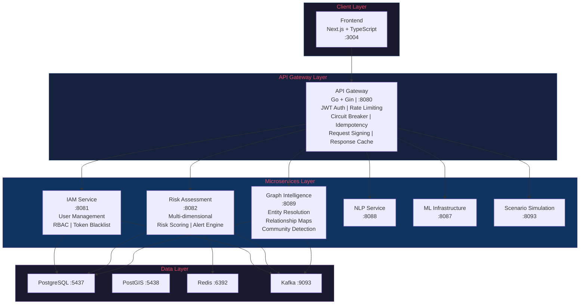
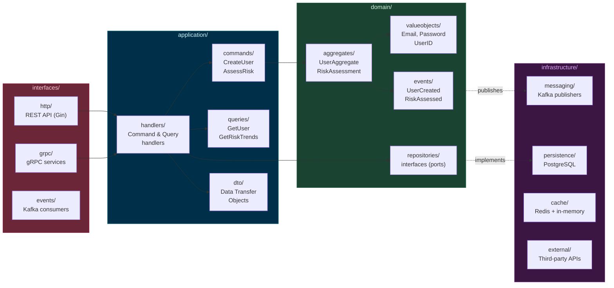
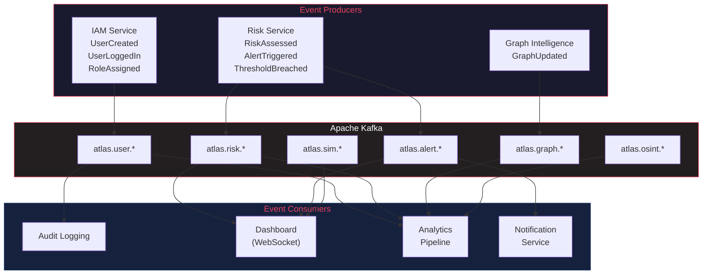
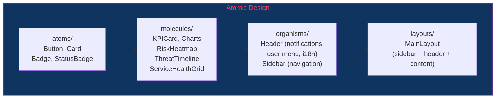
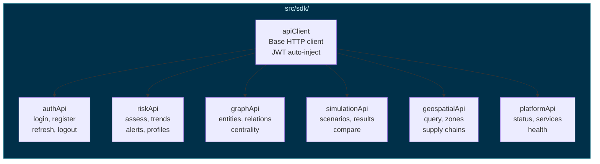
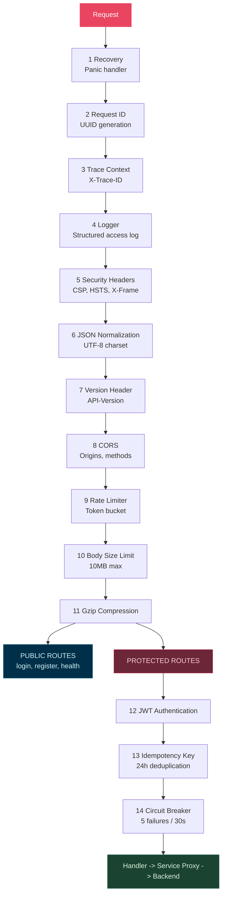
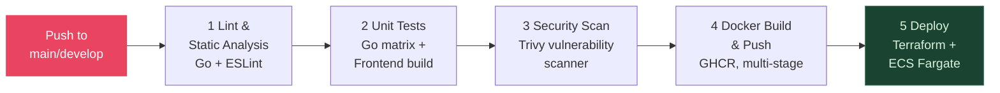

<div align="center">


# ATLAS Core API

### Strategic Intelligence Platform

**Cloud-Native | DDD + CQRS | Event-Driven | Enterprise-Grade**

[]()
[]()
[]()
[]()
[]()
[]()

[]()
[]()
[]()
[]()
[]()
[]()
[]()

**33 Microservices** | **200+ API Endpoints** | **39 Docker Containers** | **3 Languages (i18n)**

[Quick Start](#quick-start) | [Architecture](#architecture) | [API Manual](docs/API_MANUAL.md) | [Contributing](#contributing)

**[Portugues (BR)](README.pt-BR.md)** | **[Espanol](README.es.md)**

</div>

---

## Table of Contents

- [Overview](#overview)
- [Architecture](#architecture)
  - [System Design](#system-overview)
  - [DDD + CQRS Architecture](#ddd--cqrs-architecture)
  - [Event-Driven Architecture](#event-driven-architecture)
  - [Technology Stack](#technology-stack)
- [Frontend Application](#frontend-application)
- [Enterprise Features](#enterprise-features)
- [Getting Started](#getting-started)
- [API Reference](#api-reference)
- [Authentication & Authorization](#authentication--authorization)
- [Event Catalog](#event-catalog)
- [Service Registry](#service-registry)
- [Database Schema](#database-schema)
- [Middleware Pipeline](#middleware-pipeline)
- [Observability](#observability)
- [Infrastructure & DevOps](#infrastructure--devops)
- [Configuration Reference](#configuration-reference)
- [Project Structure](#project-structure)
- [Troubleshooting](#troubleshooting)
- [Roadmap](#roadmap)
- [Contributing](#contributing)
- [License](#license)

> **API Manual**: For the complete endpoint reference with request/response examples, see [docs/API_MANUAL.md](docs/API_MANUAL.md).

---

## Overview

ATLAS is an enterprise-grade **Strategic Intelligence Platform** built for organizations requiring strategic risk analysis, scenario simulation, geospatial intelligence, and near real-time decision support. Architected with **Domain-Driven Design (DDD)**, **CQRS**, and **Event-Driven Architecture** patterns across 33 cloud-native microservices, it provides:

- **Multidimensional Risk Analysis** across Operational, Financial, Reputational, Geopolitical, and Compliance dimensions
- **Machine Learning Pipeline** with MLflow experiment tracking, model serving, drift monitoring, and explainability (XAI)
- **Natural Language Processing** for entity recognition, sentiment analysis, classification, and document summarization
- **Graph Intelligence** powered by relationship mapping, centrality analysis, community detection, and risk propagation
- **Scenario Simulation** with Monte Carlo methods and agent-based modeling
- **Digital Twins** of infrastructure, supply chain, and economic systems
- **Geospatial Intelligence** with PostGIS-backed spatial queries and supply chain mapping
- **Automated Compliance** with Policy-as-Code, continuous auditing, and evidence generation
- **OSINT Collection** aggregating open-source intelligence from news, legal, and licensed data sources

---

## Architecture

### System Overview



### Technology Stack

| Layer              | Technology                                                     |
|--------------------|----------------------------------------------------------------|
| **API Gateway**    | Go 1.21, Gin, JWT, Circuit Breaker, Rate Limiter               |
| **Backend**        | Go (Gin), Python (FastAPI)                                     |
| **Frontend**       | Next.js 14, TypeScript, Tailwind CSS                           |
| **Primary DB**     | PostgreSQL 15 (Alpine) with connection pooling                 |
| **Geospatial DB**  | PostGIS 15-3.3 (Alpine)                                        |
| **Cache**          | Redis 7 (Alpine) with LRU eviction, AOF persistence           |
| **Messaging**      | Apache Kafka (Confluent 7.5) with Zookeeper                   |
| **ML/AI**          | MLflow, XGBoost, LSTM, Transformers                            |
| **GraphQL**        | Apollo Federation Gateway, Subgraph composition                |
| **Observability**  | Prometheus, Grafana, OpenTelemetry, Alertmanager               |
| **Infrastructure** | Docker, Docker Compose, Multi-stage Alpine builds              |

### Design Principles

- **Domain-Driven Design**: Bounded contexts with aggregates, value objects, and domain events
- **CQRS**: Command-Query Responsibility Segregation for write/read optimization
- **Event-Driven**: Kafka-based event streaming across all bounded contexts
- **Config-Driven Service Registry**: 33 backend services registered via environment variables
- **Circuit Breaker Pattern**: Sony gobreaker protecting all inter-service communication
- **Graceful Degradation**: In-memory cache fallback when Redis is unavailable
- **Zero-Trust Security**: JWT + API Key + HMAC request signing layers
- **Non-Root Containers**: All Docker images run as unprivileged `appuser` (uid 1000)
- **Clean Architecture**: `cmd/` > `interfaces/` > `application/` > `domain/` > `infrastructure/`

### DDD + CQRS Architecture

Each Go microservice follows Domain-Driven Design with CQRS separation:



### Event-Driven Architecture

All domain events flow through Kafka with structured envelopes:



**Event Envelope Format:**
```json
{
  "event_id": "uuid-v4",
  "event_type": "atlas.risk.assessed",
  "aggregate_id": "entity-uuid",
  "timestamp": "2024-01-15T10:30:00Z",
  "version": 1,
  "source": "risk-assessment",
  "payload": { ... }
}
```

---

## Frontend Application

The ATLAS frontend is a Next.js 14 dashboard built with TypeScript, Tailwind CSS, and Recharts. It provides a comprehensive strategic intelligence interface with a glass morphism design system and dark mode. Features 11 pages, full i18n in 3 languages (EN, PT-BR, ES), a unified SDK with typed endpoints for all 33 backend services, and React hooks (`useApiQuery`, `useApiMutation`) with graceful fallback to mock data.

### Pages & Features

| Page | Route | Description |
|------|-------|-------------|
| **Home** | `/` | Landing page with platform overview |
| **Login** | `/login` | Secure authentication with form validation, error handling, demo credentials |
| **Command Center** | `/dashboard` | Real-time threat monitoring with KPI strip, incident trend charts, system status panel, active alerts with severity/category filtering, alert detail modals, and auto-refresh controls |
| **Analytics** | `/analytics` | Multi-dimensional threat analysis with 3 tabs (Overview, Trends, Breakdown), area/bar/pie/radar charts, time range filtering, CSV/JSON export |
| **Threats** | `/threats` | Threat event management, severity filtering, acknowledgment workflows |
| **Geospatial** | `/geospatial` | Interactive world map with 6 configurable layers (infrastructure, energy, supply chain, maritime, risk zones, satellites), asset markers, layer opacity controls, 2D/3D/satellite modes, timeline playback |
| **Simulations** | `/simulations` | Multi-step scenario wizard with 6+ templates, parameter configuration, Monte Carlo execution with real-time progress, impact analysis across 7 dimensions, timeline visualization, strategic recommendations |
| **Sanctions** | `/sanctions` | OFAC/EU/UN screening, trade intelligence, watchlist management |
| **Compliance** | `/compliance` | Regulatory tracking for GDPR, LGPD, SOC 2, ISO 27001, audit log table, data governance policies (encryption, retention, access control) |
| **Reports** | `/reports` | Executive briefings, export capabilities, scheduled report generation |
| **Settings** | `/settings` | User preferences, system configuration, API key management |

### Frontend Tech Stack

| Layer | Technology |
|-------|------------|
| **Framework** | Next.js 14 (App Router) |
| **Language** | TypeScript 5.5 |
| **Styling** | Tailwind CSS 3.4 |
| **State** | Zustand 4.5 (auth, UI, dashboard, map, platform, threat, simulation, geo stores) |
| **Server State** | TanStack React Query 5.5 |
| **Charts** | Recharts 2.12 |
| **Animations** | Framer Motion 11.3 |
| **Dates** | date-fns 3.6 |

### Internationalization (i18n)

Full multi-language support with automatic browser detection and persistent preferences:

| Language | Locale | Status |
|----------|--------|--------|
| English | `en` | Complete (default) |
| Portuguese (Brazil) | `pt-BR` | Complete |
| Spanish | `es` | Complete |

- Context-based translation system with `useI18n()` hook and `t()` function
- Nested key support (e.g., `t("dashboard.alerts.criticalInfra")`)
- Language switcher in the header with flag indicators
- LocalStorage persistence (`atlas-locale` key)
- Fallback to English for missing keys
- All 11 application pages fully internationalized

### Component Architecture



### State Management (Zustand Stores)

| Store | Purpose |
|-------|---------|
| `useAuthStore` | User session, authentication state (localStorage persisted) |
| `useUIStore` | Sidebar toggle, theme, notifications |
| `useDashboardStore` | Time range, risk level filters, refresh interval |
| `useMapStore` | Map viewport, visible layers, selected feature |
| `usePlatformStore` | Service health status, last health check |
| `useThreatStore` | Threat event management, severity filtering, acknowledgment |
| `useSimulationStore` | Simulation runs, progress tracking, active run state |
| `useGeoStore` | Map viewport, layer controls, feature selection, map mode |

### Typed API SDK



### Custom Hooks

| Hook | Purpose |
|------|---------|
| `useAlerts` | Alert management with filtering, acknowledgment, investigation, dismissal |
| `useAutoRefresh` | Configurable auto-refresh with countdown and manual trigger |
| `useAuth` | Authentication context (login, logout, user state) |
| `useI18n` | Translation function and locale management |

---

## Enterprise Features

### Authentication & Security

| Feature                    | Description                                                         |
|----------------------------|---------------------------------------------------------------------|
| JWT Authentication         | HMAC-SHA256 signed tokens with configurable expiration (default 1h) |
| Refresh Token Rotation     | Secure token renewal with 7-day refresh tokens                      |
| Token Blacklisting         | In-memory blacklist with background cleanup (30-min intervals)      |
| API Key Authentication     | SHA256-hashed keys with scopes, rate limits, and IP allowlists      |
| HMAC Request Signing       | `X-Request-Signature` with 5-minute replay window protection        |
| MFA Support                | Optional TOTP-based multi-factor authentication                     |
| Account Lockout            | Configurable max attempts (default 5) with lockout duration (15m)   |
| RBAC                       | Role-based access control (admin, analyst, viewer, operator)        |
| Permission System          | Granular resource:action permissions with wildcard support           |
| Password Policy            | Minimum length, special character requirements                      |

### Resilience & Performance

| Feature                | Description                                                            |
|------------------------|------------------------------------------------------------------------|
| Circuit Breaker        | Per-service circuit breakers via Sony gobreaker (5 max failures, 30s)  |
| Rate Limiting          | Configurable RPS (default 100/s) + strict mode (20/min) for sensitive  |
| Response Caching       | SHA256-keyed GET response cache with Redis backend                     |
| Idempotency Keys       | 24-hour deduplication for POST/PUT/PATCH via `Idempotency-Key` header  |
| Connection Pooling     | HTTP: 100 max idle / 10 per host. PostgreSQL: 25 open / 10 idle       |
| Body Size Limiting     | 10MB max request body with `http.MaxBytesReader`                       |
| Gzip Compression       | Automatic response compression via `gin-contrib/gzip`                  |
| Graceful Shutdown      | Configurable timeout (default 30s) with concurrent server drain        |

### Observability

| Feature              | Description                                                     |
|----------------------|-----------------------------------------------------------------|
| Prometheus Metrics   | HTTP request duration, status codes, response sizes on `:9090`  |
| OpenTelemetry        | Distributed tracing via OTLP/gRPC (replaces deprecated Jaeger) |
| Structured Logging   | JSON logs via `zap` with request ID correlation                 |
| Request Tracing      | `X-Request-ID` + `X-Trace-ID` propagation across services      |
| Health Checks        | `/health`, `/healthz` (liveness), `/readyz` (readiness)        |
| Access Logging       | Full HTTP access log with latency, status, sizes               |

### Enterprise Middleware

| Feature              | Description                                                      |
|----------------------|------------------------------------------------------------------|
| Security Headers     | X-Frame-Options, CSP, HSTS, Permissions-Policy, Referrer-Policy  |
| CORS                 | Configurable origins, methods, headers, credentials              |
| API Versioning       | `API-Version` + `X-API-Version` response headers                 |
| Deprecation Warnings | `Sunset` + `Deprecation` headers for deprecated endpoints        |
| Sensitive Endpoints  | Enhanced logging + cache disabling for sensitive operations       |
| Request Timeout      | Per-request configurable timeout headers                         |
| JSON Normalization   | UTF-8 charset enforcement on all responses                       |

---

## Getting Started

### Prerequisites

- Docker Desktop (Windows/Mac) or Docker Engine + Compose (Linux)
- Git
- Minimum 8GB RAM, 20GB free disk space
- Go 1.21+ (for local development only)

### Quick Start

```bash
# Clone the repository
git clone https://github.com/your-org/atlas-core-api.git
cd atlas-core-api

# Configure environment
cp .env.example .env
# Edit .env with your credentials (change JWT_SECRET for production)

# Start all 39 containers
docker compose up --build
```

### Service Endpoints

| Service              | URL                          | Description              |
|----------------------|------------------------------|--------------------------|
| Frontend             | `http://localhost:3004`      | Next.js dashboard        |
| API Gateway          | `http://localhost:8080`      | Main API entry point     |
| IAM Service          | `http://localhost:8084`      | Identity management      |
| Risk Assessment      | `http://localhost:8086`      | Risk scoring engine      |
| Graph Intelligence   | `http://localhost:8089`      | Relationship analysis    |
| Prometheus Metrics   | `http://localhost:9090`      | Gateway metrics          |
| PostgreSQL           | `localhost:5437`             | Primary database         |
| PostGIS              | `localhost:5438`             | Geospatial database      |
| Redis                | `localhost:6392`             | Cache & sessions         |
| Kafka                | `localhost:9093`             | Event streaming          |
| Zookeeper            | `localhost:2181`             | Kafka coordination       |

### Health Check

```bash
# Gateway health
curl http://localhost:8080/health

# Liveness probe (Kubernetes-compatible)
curl http://localhost:8080/healthz

# Readiness probe
curl http://localhost:8080/readyz
```

---

## API Reference

> **Complete API Manual**: For the full endpoint reference with request/response examples, SDK samples (cURL, JavaScript, Python), and integration guide, see **[docs/API_MANUAL.md](docs/API_MANUAL.md)**.

**Base URL**: `http://localhost:8080/api/v1`

All protected endpoints require:
```
Authorization: Bearer <jwt_token>
```

### Authentication

| Method | Endpoint               | Auth     | Description                    |
|--------|------------------------|----------|--------------------------------|
| POST   | `/auth/login`          | Public   | Login with username/password   |
| POST   | `/auth/register`       | Public   | Register new user account      |
| POST   | `/auth/refresh`        | Public   | Refresh access token           |
| GET    | `/auth/validate`       | Public   | Validate token                 |
| POST   | `/auth/logout`         | Bearer   | Logout (blacklists token)      |
| POST   | `/auth/change-password`| Bearer   | Change password (sensitive)    |

#### Login

```bash
curl -X POST http://localhost:8080/api/v1/auth/login \
  -H "Content-Type: application/json" \
  -d '{"username": "admin", "password": "Admin@2024"}'
```

> **Demo Credentials**: `admin` / `Admin@2024` (password must be 8+ characters)

Response:
```json
{
  "access_token": "eyJhbGciOiJIUzI1NiIs...",
  "refresh_token": "eyJhbGciOiJIUzI1NiIs...",
  "token_type": "Bearer",
  "expires_in": 3600,
  "user": {
    "id": "uuid",
    "username": "admin",
    "email": "admin@atlas.com",
    "roles": ["admin"]
  }
}
```

#### Register

```bash
curl -X POST http://localhost:8080/api/v1/auth/register \
  -H "Content-Type: application/json" \
  -d '{
    "username": "analyst01",
    "email": "analyst@atlas.com",
    "password": "SecurePass!123"
  }'
```

### User Management

| Method | Endpoint                       | Auth   | Description                |
|--------|--------------------------------|--------|----------------------------|
| GET    | `/users/me`                    | Bearer | Get current user profile   |
| GET    | `/users/:id`                   | Bearer | Get user by ID             |
| PUT    | `/users/:id`                   | Bearer | Update user (self or admin)|
| DELETE | `/users/:id`                   | Admin  | Delete user                |
| GET    | `/admin/users`                 | Admin  | List all users (paginated) |

### Role Management (Admin)

| Method | Endpoint                       | Auth  | Description                |
|--------|--------------------------------|-------|----------------------------|
| GET    | `/admin/roles`                 | Admin | List all roles             |
| POST   | `/admin/roles`                 | Admin | Create new role            |
| POST   | `/admin/users/:id/roles/:roleId`  | Admin | Assign role to user    |
| DELETE | `/admin/users/:id/roles/:roleId`  | Admin | Remove role from user  |

### Data Ingestion

| Method | Endpoint                         | Description                  |
|--------|----------------------------------|------------------------------|
| GET    | `/ingestion/sources`             | List data sources            |
| POST   | `/ingestion/sources`             | Create new source            |
| GET    | `/ingestion/sources/:id`         | Source details               |
| POST   | `/ingestion/sources/:id/data`    | Send data for ingestion      |
| POST   | `/ingestion/sources/:id/trigger` | Trigger manual ingestion     |
| GET    | `/ingestion/status`              | General ingestion status     |

### Data Normalization

| Method | Endpoint                           | Description             |
|--------|------------------------------------|-------------------------|
| GET    | `/normalization/rules`             | List normalization rules|
| POST   | `/normalization/rules`             | Create rule             |
| GET    | `/normalization/rules/:id`         | Rule details            |
| PUT    | `/normalization/rules/:id`         | Update rule             |
| DELETE | `/normalization/rules/:id`         | Remove rule             |
| GET    | `/normalization/quality/:data_id`  | Dataset quality metrics |
| GET    | `/normalization/stats`             | Aggregated statistics   |

### Risk Assessment

| Method | Endpoint                       | Description                   |
|--------|--------------------------------|-------------------------------|
| POST   | `/risks/assess`                | Assess entity risk            |
| GET    | `/risks/:id`                   | Get specific assessment       |
| GET    | `/risks/trends`                | Risk trends over time         |
| GET    | `/risks/entities/:entity_id`   | Assessments by entity         |
| POST   | `/risks/alerts`                | Configure risk alerts         |
| GET    | `/risks/profiles`              | Executive risk profiles       |

### Audit & Compliance

| Method | Endpoint                       | Description                |
|--------|--------------------------------|----------------------------|
| POST   | `/audit/events`                | Create audit event         |
| GET    | `/audit/logs`                  | List audit logs            |
| GET    | `/audit/logs/:id`              | Log details                |
| GET    | `/audit/compliance/report`     | Compliance report          |
| GET    | `/compliance/status`           | Consolidated compliance    |
| GET    | `/compliance/lineage/:id`      | Data lineage tracking      |

### ML Infrastructure

| Method | Endpoint                          | Description             |
|--------|-----------------------------------|-------------------------|
| GET    | `/ml/models`                      | List registered models  |
| POST   | `/ml/models`                      | Register model          |
| POST   | `/ml/models/:model_name/predict`  | Run prediction          |
| GET    | `/ml/experiments`                 | List experiments        |
| GET    | `/ml/health`                      | ML infrastructure health|

### NLP Services

| Method | Endpoint              | Description                  |
|--------|-----------------------|------------------------------|
| POST   | `/nlp/ner`            | Named Entity Recognition     |
| POST   | `/nlp/sentiment`      | Sentiment analysis           |
| POST   | `/nlp/classify`       | Text classification          |
| POST   | `/nlp/summarize`      | Document summarization       |

### Graph Intelligence

| Method | Endpoint                                | Description              |
|--------|-----------------------------------------|--------------------------|
| POST   | `/graph/entities/resolve`               | Entity resolution        |
| GET    | `/graph/entities/:id/relationships`     | Entity relationships     |
| GET    | `/graph/entities/:id/risk-propagation`  | Risk propagation paths   |
| GET    | `/graph/analytics/centrality`           | Centrality analysis      |
| GET    | `/graph/analytics/communities`          | Community detection      |

### Geospatial Intelligence

| Method | Endpoint                        | Description             |
|--------|---------------------------------|-------------------------|
| POST   | `/geospatial/query`             | Spatial query           |
| GET    | `/geospatial/zones`             | Zone/layer listing      |
| POST   | `/geospatial/context`           | Location context        |
| GET    | `/geospatial/supply-chains`     | Supply chain maps       |
| POST   | `/geospatial/supply-chains`     | Create supply chain map |

### OSINT & News

| Method | Endpoint              | Description                |
|--------|-----------------------|----------------------------|
| GET    | `/osint/analysis`     | OSINT analysis             |
| GET    | `/osint/signals`      | Intelligence signals       |
| GET    | `/news/articles`      | Aggregated news articles   |
| GET    | `/news/sources`       | News sources               |
| POST   | `/briefings/generate` | Generate executive briefing|

### Scenario Simulation

| Method | Endpoint                              | Description             |
|--------|---------------------------------------|-------------------------|
| POST   | `/simulations/scenarios`              | Create scenario         |
| GET    | `/simulations/:simulation_id`         | Get simulation results  |
| GET    | `/simulations/:simulation_id/results` | Detailed results        |
| POST   | `/simulations/compare`                | Compare scenarios       |

### Enterprise Endpoints

| Area             | Method | Endpoint                        | Description                |
|------------------|--------|---------------------------------|----------------------------|
| XAI              | POST   | `/xai/explain`                  | Explain model decision     |
| XAI              | POST   | `/xai/batch`                    | Batch explanations         |
| War-Gaming       | POST   | `/wargaming/scenarios`          | Create war-game scenario   |
| Digital Twins    | GET    | `/twins`                        | List digital twins         |
| Digital Twins    | POST   | `/twins`                        | Create digital twin        |
| Policy Impact    | POST   | `/policy/analyze`               | Policy impact analysis     |
| Multi-Region     | GET    | `/regions`                      | List regions               |
| Data Residency   | GET    | `/residency/policies`           | Data residency policies    |
| Federated ML     | POST   | `/federated/training/start`     | Start federated training   |
| Mobile API       | GET    | `/mobile/dashboard`             | Mobile dashboard data      |
| Compliance       | GET    | `/compliance/automation/status` | Automation status          |

### Platform Status

| Method | Endpoint                  | Description                           |
|--------|---------------------------|---------------------------------------|
| GET    | `/platform/status`        | Aggregated status of all services     |
| GET    | `/platform/services`      | List registered services              |

### Idempotency

For mutating operations (POST, PUT, PATCH), include an idempotency key:

```bash
curl -X POST http://localhost:8080/api/v1/risks/assess \
  -H "Authorization: Bearer <token>" \
  -H "Idempotency-Key: unique-request-id-123" \
  -H "Content-Type: application/json" \
  -d '{"entity_id": "...", "entity_type": "organization"}'
```

Replayed responses include `X-Idempotent-Replayed: true`.

---

## Authentication & Authorization

### JWT Token Structure

```json
{
  "user_id": "uuid",
  "username": "admin",
  "email": "admin@atlas.com",
  "roles": ["admin"],
  "permissions": ["risk:read", "risk:write", "user:manage"],
  "mfa_verified": false,
  "exp": 1700000000,
  "iat": 1699996400
}
```

### Default Roles

| Role       | Description                             |
|------------|-----------------------------------------|
| `admin`    | Full system access, user management     |
| `analyst`  | Read/write access to analysis features  |
| `viewer`   | Read-only access                        |
| `operator` | Operational management access           |

### Default Permissions

| Permission              | Resource      | Action |
|-------------------------|---------------|--------|
| `risk:read`             | risk          | read   |
| `risk:write`            | risk          | write  |
| `user:read`             | user          | read   |
| `user:manage`           | user          | manage |
| `audit:read`            | audit         | read   |
| `data:ingest`           | data          | ingest |
| `model:predict`         | model         | predict|

### API Key Authentication

For service-to-service communication:

```bash
curl http://localhost:8080/api/v1/risks/trends \
  -H "X-API-Key: your-api-key-here"
```

### HMAC Request Signing

For high-security endpoints:

```bash
# Signature = HMAC-SHA256(secret, "{timestamp}.{path}.{body}")
curl http://localhost:8080/api/v1/risks/assess \
  -H "X-Request-Signature: <hmac-signature>" \
  -H "X-Request-Timestamp: <unix-timestamp>"
```

---

## Service Registry

The API Gateway proxies requests to 33 backend services via a config-driven registry. Each service URL is configurable via environment variables. Total deployment: **39 Docker containers** (33 services + PostgreSQL, PostGIS, Redis, Kafka, Zookeeper, Prometheus, Grafana).

### Core Services (Go)

| Service | Port | Description |
|---------|------|-------------|
| api-gateway | 8080 | Central proxy, JWT auth, rate limiting, circuit breaker |
| iam-service | 8081 | Identity management, RBAC, user CRUD |
| risk-assessment | 8082 | Multi-dimensional risk scoring, alerts |
| ingestion-service | 8083 | Multi-source data ingestion, Kafka producer |
| normalization-service | 8084 | Data quality checks, normalization rules |
| audit-logging | 8085 | Immutable audit trail, Kafka consumer |
| graph-intelligence | 8089 | Entity resolution, community detection |

### Intelligence Services (Python)

| Service | Port | Description |
|---------|------|-------------|
| scenario-simulation | 8093 | Monte Carlo, agent-based modeling (PostgreSQL) |
| news-aggregator | 8113 | RSS/OSINT ingestion (Redis + PostgreSQL) |
| sanctions-screening | 8092 | OFAC/EU/UN screening, trade intelligence |
| nlp-service | 8094 | NER, sentiment, classification (PostgreSQL) |
| compliance-automation | 8102 | Policy scanning, evidence generation (PostgreSQL) |
| war-gaming | 8099 | Defensive war-gaming scenarios (PostgreSQL) |
| digital-twins | 8100 | Entity simulation & sync |
| policy-impact | 8101 | Policy scenario analysis |
| advanced-rd | 8103 | Experimental threat simulation |
| xai-service | 8098 | Explainable AI |

### ML Services (Python)

| Service | Port | Description |
|---------|------|-------------|
| ml-infrastructure | 8115 | MLflow integration, model management |
| model-serving | 8096 | Model inference & prediction |
| model-monitoring | 8097 | Drift detection, performance tracking |
| federated-learning | 8106 | Distributed ML training |

### Platform Services (Python)

| Service | Port | Description |
|---------|------|-------------|
| multi-region | 8104 | Multi-region deployment & failover |
| data-residency | 8105 | Geo-compliance validation |
| mobile-api | 8107 | Mobile backend, offline sync |
| cost-optimization | 8108 | Cost analysis & budgeting |
| performance-optimization | 8109 | SLO analysis |
| security-certification | 8110 | Security assessments |
| continuous-improvement | 8111 | Metrics & feedback |

### Frontend & Gateway

| Service | Port | Description |
|---------|------|-------------|
| frontend | 3004 | Next.js 14, React 18, i18n (EN/PT-BR/ES) |
| graphql-gateway | 4000 | Apollo Federation |

### Observability

| Service | Port | Description |
|---------|------|-------------|
| prometheus | 9091 | Metrics aggregation, 10 alert rules |
| grafana | 3005 | 2 dashboards (overview + business) |
| postgres-exporter | 9187 | PostgreSQL metrics |
| redis-exporter | 9121 | Redis metrics |

---

## Database Schema

**4 migration files** | **69 tables total**

### Migration 000001: Core Tables (12 tables)

```sql
-- IAM
users (id UUID PK, username UNIQUE, email UNIQUE, password_hash, is_active, is_verified, last_login_at)
roles (id UUID PK, name UNIQUE, description)
permissions (id UUID PK, name UNIQUE, resource, action, description)
user_roles (user_id FK, role_id FK, composite PK)
role_permissions (role_id FK, permission_id FK)

-- Risk Assessment
risk_assessments (id UUID PK, entity_id, entity_type, overall_score, operational_score,
                  financial_score, reputational_score, geopolitical_score, compliance_score)
risk_alerts (id UUID PK, assessment_id FK, severity ENUM, is_resolved, resolved_by)

-- Audit & Compliance
audit_logs (id UUID PK, user_id, action, resource, resource_id, ip_address, user_agent, details JSONB)
compliance_events (id UUID PK, event_type, regulation, status, evidence JSONB)

-- Data Ingestion
data_sources (id UUID PK, name UNIQUE, source_type, config JSONB, is_active)
ingestion_runs (id UUID PK, source_id FK, status, records_processed, records_failed, error_message)
```

### Migration 000002: Geospatial Tables (5 tables)

PostGIS-enabled tables for spatial queries, zone management, and supply chain geographic mapping.

### Migration 000003: Enterprise Tables (7 tables)

```sql
-- API Key Management
api_keys (id UUID PK, key_hash UNIQUE, key_prefix, owner_id FK, scopes TEXT[],
          rate_limit_rps, allowed_ips TEXT[], expires_at)

-- Token & Session Management
token_blacklist (id UUID PK, token_hash, user_id FK, reason, expires_at)
login_attempts (id UUID PK, username, ip_address, success BOOL, user_agent, failure_reason)
user_sessions (id UUID PK, user_id FK, token_hash, ip_address, device_info JSONB, expires_at)

-- Webhook System
webhook_subscriptions (id UUID PK, url, secret, events TEXT[], owner_id FK, retry_count, timeout_seconds)
webhook_deliveries (id UUID PK, subscription_id FK, event_type, payload JSONB, response_status, success)

-- Feature Flags
feature_flags (id UUID PK, name UNIQUE, is_enabled, rules JSONB, rollout_percentage 0-100, created_by FK)
```

### Migration 000004: Platform Services (45 tables)

Tables for all platform services including scenario simulation, sanctions screening, news aggregation, compliance automation, war-gaming, digital twins, policy impact, ML infrastructure, model serving, model monitoring, federated learning, multi-region, data residency, mobile API, cost optimization, performance optimization, security certification, continuous improvement, and advanced R&D.

### Seed Data

The initial migration seeds:
- **4 roles**: admin, analyst, viewer, operator
- **7 permissions**: risk:read, risk:write, user:read, user:manage, audit:read, data:ingest, model:predict
- **Admin user**: `admin` / `admin@atlas.com`

---

## Middleware Pipeline

Requests flow through the following middleware chain in order:



---

## Observability

### Prometheus Metrics

Prometheus with **15 scrape targets** collecting metrics from all services. Available at `http://localhost:9091/metrics`.

- `http_requests_total` - Total HTTP requests by method, path, status
- `http_request_duration_seconds` - Request latency histogram
- `http_response_size_bytes` - Response size histogram

### Alert Rules (10 rules)

| Rule | Condition | Severity |
|------|-----------|----------|
| ServiceDown | Instance unreachable for 1m | critical |
| HighErrorRate | >5% 5xx errors over 5m | critical |
| HighLatency | p95 latency >2s over 5m | warning |
| DBPoolExhausted | Active connections >90% of max | critical |
| HighMemoryUsage | Memory >85% for 5m | warning |
| KafkaConsumerLag | Consumer lag >1000 for 5m | warning |
| RedisHighMemory | Redis memory >80% | warning |
| CertificateExpiry | TLS cert expires in <30d | warning |
| HighDiskUsage | Disk >85% | warning |
| PodRestartLoop | >3 restarts in 15m | critical |

### Grafana Dashboards

Available at `http://localhost:3005`:

| Dashboard | Description |
|-----------|-------------|
| **atlas-overview** | Service health, request rates, error rates, latency percentiles, resource usage |
| **atlas-business** | Business KPIs, risk assessments over time, simulation runs, compliance status |

### Exporters

| Exporter | Port | Metrics |
|----------|------|---------|
| postgres-exporter | 9187 | PostgreSQL connections, queries, replication, table stats |
| redis-exporter | 9121 | Redis memory, commands, keyspace, clients |

### Structured Logging

All services use `zap` for structured JSON logging:

```json
{
  "level": "info",
  "msg": "HTTP Request",
  "method": "POST",
  "path": "/api/v1/auth/login",
  "status": 200,
  "latency": "12.345ms",
  "ip": "172.28.0.1",
  "request_id": "550e8400-e29b-41d4-a716-446655440000",
  "request_size": 64,
  "response_size": 512
}
```

### Distributed Tracing

OpenTelemetry with OTLP/gRPC exporter (configurable):

```bash
TRACING_ENABLED=true
JAEGER_ENDPOINT=localhost:4317  # OTLP gRPC endpoint
TRACING_SAMPLING_FRACTION=0.1
```

### Health Checks

Every service implements Docker health checks:

| Endpoint   | Purpose                              |
|------------|--------------------------------------|
| `/health`  | Full health with dependency checks   |
| `/healthz` | Kubernetes liveness probe            |
| `/readyz`  | Kubernetes readiness probe           |

---

## Configuration Reference

All configuration is managed via environment variables. See `.env.example` for the complete reference.

### Critical Settings

| Variable              | Default                  | Description                          |
|-----------------------|--------------------------|--------------------------------------|
| `ENVIRONMENT`         | `development`            | Environment (development/production) |
| `JWT_SECRET`          | `change-me-in-production`| **Must change in production**        |
| `POSTGRES_PASSWORD`   | `atlas_dev`              | Database password                    |
| `SERVER_PORT`         | `8080`                   | API Gateway port                     |

### Server

| Variable                  | Default | Description            |
|---------------------------|---------|------------------------|
| `SERVER_HOST`             | `0.0.0.0` | Bind address        |
| `SERVER_READ_TIMEOUT`     | `30s`   | Read timeout           |
| `SERVER_WRITE_TIMEOUT`    | `30s`   | Write timeout          |
| `SERVER_IDLE_TIMEOUT`     | `120s`  | Idle timeout           |
| `SERVER_SHUTDOWN_TIMEOUT` | `30s`   | Graceful shutdown      |
| `SERVER_GRACEFUL_SHUTDOWN`| `true`  | Enable graceful shutdown|

### Authentication

| Variable                   | Default | Description                |
|----------------------------|---------|----------------------------|
| `JWT_EXPIRATION`           | `15m`   | Access token TTL           |
| `REFRESH_TOKEN_EXPIRATION` | `168h`  | Refresh token TTL (7 days) |
| `MAX_LOGIN_ATTEMPTS`       | `5`     | Max failed login attempts  |
| `LOCKOUT_DURATION`         | `15m`   | Account lockout duration   |
| `PASSWORD_MIN_LENGTH`      | `8`     | Minimum password length    |
| `PASSWORD_REQUIRE_SPECIAL` | `true`  | Require special characters |
| `MFA_REQUIRED`             | `false` | Enforce MFA                |

### Cache

| Variable              | Default                  | Description              |
|-----------------------|--------------------------|--------------------------|
| `CACHE_TYPE`          | `redis`                  | Cache backend            |
| `CACHE_TTL`           | `1h`                     | Default cache TTL        |
| `REDIS_URL`           | `redis://localhost:6392` | Redis connection URL     |
| `CACHE_MAX_SIZE`      | `1000`                   | Max in-memory entries    |
| `CACHE_EVICTION_POLICY`| `lru`                   | Eviction policy          |

### Rate Limiting

| Variable           | Default | Description              |
|--------------------|---------|--------------------------|
| `RATE_LIMIT_ENABLED`| `true` | Enable rate limiting     |
| `RATE_LIMIT_RPS`   | `100`   | Requests per second      |
| `RATE_LIMIT_BURST` | `50`    | Burst allowance          |

### CORS

| Variable                | Default                              | Description            |
|-------------------------|--------------------------------------|------------------------|
| `CORS_ENABLED`          | `true`                               | Enable CORS            |
| `CORS_ALLOWED_ORIGINS`  | `http://localhost:3004`              | Allowed origins (CSV)  |
| `CORS_ALLOWED_METHODS`  | `GET,POST,PUT,DELETE,OPTIONS`        | Allowed methods (CSV)  |
| `CORS_ALLOW_CREDENTIALS`| `true`                               | Allow credentials      |
| `CORS_MAX_AGE`          | `86400`                              | Preflight cache (sec)  |

### Database

| Variable               | Default     | Description               |
|------------------------|-------------|---------------------------|
| `DATABASE_URL`         | (composed)  | Full PostgreSQL URL       |
| `DATABASE_MAX_CONNECTIONS`| `25`     | Max open connections      |
| `DATABASE_MIN_CONNECTIONS`| `5`      | Min idle connections      |
| `DATABASE_SSLMODE`     | `disable`   | SSL mode                  |
| `DATABASE_LOG_QUERIES` | `false`     | Log SQL queries           |

---

## Project Structure

```
atlas-core-api/
|-- docker-compose.yml              # Service orchestration
|-- .env.example                    # Environment configuration template
|-- README.md                       # This file (English)
|-- README.pt-BR.md                 # Portugues (Brasil)
|-- README.es.md                    # Espanol
|-- migrations/
|   |-- 000001_init_schema.up.sql   # Core tables (IAM, risk, audit, ingestion) - 12 tables
|   |-- 000002_geospatial.up.sql    # PostGIS extensions - 5 tables
|   |-- 000003_enterprise_features.up.sql  # API keys, sessions, webhooks, flags - 7 tables
|   |-- 000004_platform_services.up.sql    # All platform service tables - 45 tables
|
|-- services/
|   |-- api-gateway/                # API Gateway (Go, Gin) - :8080
|   |   |-- cmd/main.go
|   |   |-- internal/
|   |   |   |-- api/
|   |   |   |   |-- handlers/       # Auth, health check handlers
|   |   |   |   |-- middleware/      # Auth, cache, CORS, rate limit, idempotency, security
|   |   |   |   |-- router/         # Config-driven route registry (33 services)
|   |   |   |-- infrastructure/
|   |   |       |-- cache/           # Redis + in-memory cache
|   |   |       |-- config/          # Environment-based configuration
|   |   |       |-- observability/
|   |   |       |   |-- metrics/     # Prometheus instrumentation
|   |   |       |   |-- tracing/     # OpenTelemetry OTLP/gRPC
|   |   |       |-- resilience/
|   |   |           |-- circuitbreaker/  # Sony gobreaker pool
|   |   |-- Dockerfile
|   |
|   |-- iam/                        # Identity & Access Management (Go, DDD+CQRS) - :8081
|   |   |-- cmd/main.go
|   |   |-- internal/
|   |   |   |-- domain/
|   |   |   |   |-- aggregates/     # UserAggregate (aggregate root)
|   |   |   |   |-- valueobjects/   # Email, HashedPassword, UserID
|   |   |   |   |-- events/         # UserCreated, UserLoggedIn, LoginFailed
|   |   |   |   |-- repositories/   # UserRepository, RoleRepository (interfaces)
|   |   |   |-- application/
|   |   |   |   |-- commands/       # CreateUserCommand, LoginUserCommand
|   |   |   |   |-- queries/        # GetUserQuery, ListUsersQuery
|   |   |   |   |-- handlers/       # CreateUserHandler, LoginUserHandler
|   |   |   |   |-- dto/            # UserDTO, AuthTokensDTO
|   |   |   |-- infrastructure/
|   |   |   |   |-- persistence/    # PostgreSQL repository implementations
|   |   |   |   |-- messaging/      # Kafka event publisher
|   |   |   |   |-- config/         # Environment-based configuration
|   |   |   |-- api/handlers/       # HTTP handlers (Gin)
|   |   |   |-- api/middleware/      # JWT auth, role/permission guards
|   |   |-- Dockerfile
|   |
|   |-- risk-assessment/            # Risk Assessment (Go, DDD+CQRS) - :8082
|   |-- ingestion/                  # Data Ingestion (Go) + Kafka
|   |-- normalization/              # Data Normalization (Go) + Kafka
|   |-- audit-logging/              # Audit Logging (Go) + Kafka
|   |-- graph-intelligence/         # Graph Intelligence (Go) - :8089
|   |-- frontend/                   # Next.js 14 Dashboard - :3000
|   |   |-- src/
|   |   |   |-- app/                # Pages (login, dashboard, analytics, threats, simulations, geospatial, sanctions, compliance, reports, settings, home)
|   |   |   |-- components/
|   |   |   |   |-- atoms/          # Button, Card, Badge, StatusBadge
|   |   |   |   |-- molecules/      # KPICard, Charts, RiskHeatmap, ThreatTimeline, ServiceHealthGrid
|   |   |   |   |-- organisms/      # Header, Sidebar (with i18n language switcher)
|   |   |   |   |-- layouts/        # MainLayout (sidebar + header + content)
|   |   |   |-- contexts/          # AuthContext (JWT session management)
|   |   |   |-- hooks/             # useAlerts, useAutoRefresh, useAuth, useI18n
|   |   |   |-- i18n/              # Internationalization (en, pt-BR, es) - 500+ keys
|   |   |   |-- sdk/               # Typed SDK: apiClient, authApi, riskApi, graphApi, simulationApi, geospatialApi, platformApi
|   |   |   |-- store/             # Zustand stores (auth, UI, dashboard, map, platform, threat, simulation, geo)
|   |   |   |-- types/             # TypeScript definitions
|   |   |   |-- utils/             # Utility functions (formatDate, cn, etc.)
|   |   |-- Dockerfile
|   |
|   |-- ml-infrastructure/          # ML Pipeline (Python)
|   |-- nlp-service/                # NLP Processing (Python)
|   |-- xai-service/                # Explainable AI (Python)
|   |-- model-serving/              # Model Serving (Python)
|   |-- model-monitoring/           # Model Monitoring (Python)
|   |-- scenario-simulation/        # Monte Carlo Simulation (Python)
|   |-- war-gaming/                 # War-Gaming Engine (Python)
|   |-- digital-twins/              # Digital Twins (Python)
|   |-- policy-impact/              # Policy Impact Analysis (Python)
|   |-- multi-region/               # Multi-Region Controller (Python)
|   |-- data-residency/             # Data Residency (Python)
|   |-- federated-learning/         # Federated Learning (Python)
|   |-- mobile-api/                 # Mobile API (Python)
|   |-- compliance-automation/      # Compliance Automation (Python)
|   |-- performance-optimization/   # Performance Optimization (Python)
|   |-- cost-optimization/          # Cost Optimization (Python)
|   |-- advanced-rd/                # Advanced R&D (Python)
|   |-- security-certification/     # Security Certification (Python)
|   |-- continuous-improvement/     # Continuous Improvement (Python)
|
|-- pkg/
|   |-- events/                      # Shared Kafka event schemas (Go)
|       |-- events.go                # Event envelope, topic constants, payload types
|
|-- infrastructure/
|   |-- terraform/                   # AWS infrastructure (ECS, RDS, Redis, MSK)
|       |-- main.tf
|       |-- variables.tf
|       |-- outputs.tf
|
|-- .github/
|   |-- workflows/
|       |-- ci.yml                   # CI/CD pipeline (lint, test, security, build, deploy)
|
|-- docs/
|   |-- atlas-logo.svg              # Project logo/favicon
|   |-- events/README.md            # Event catalog documentation
|   |-- API_MANUAL.md               # Complete API endpoint reference
|   |-- PHASE_1_MVP.md
|   |-- PHASE_2_ANALYTICS.md
|   |-- PHASE_3_DECISION_SUPPORT.md
|   |-- PHASE_4_STRATEGIC_PLATFORM.md
|   |-- PHASE_5_OPTIMIZATION.md
|   |-- AI_ML_STRATEGY.md
```

---

## Event Catalog

All domain events are published to Kafka with guaranteed ordering per aggregate.

| Topic | Producer | Consumers | Description |
|-------|----------|-----------|-------------|
| `atlas.user.created` | IAM | Audit, Notification | New user registration |
| `atlas.user.logged_in` | IAM | Audit, Analytics | Successful login |
| `atlas.user.login_failed` | IAM | Security, Audit | Failed login attempt |
| `atlas.user.role_assigned` | IAM | Audit, Notification | Role assignment |
| `atlas.user.deactivated` | IAM | Audit, Cleanup | Account deactivation |
| `atlas.risk.assessed` | Risk Assessment | Dashboard, Analytics | Risk assessment completed |
| `atlas.alert.triggered` | Risk Assessment | Notification, Dashboard | Risk threshold breach |
| `atlas.alert.resolved` | Risk Assessment | Dashboard, Audit | Alert resolution |
| `atlas.simulation.completed` | Scenario Simulation | Dashboard, Analytics | Simulation finished |
| `atlas.simulations.completed` | Scenario Simulation | Dashboard, Analytics | Simulation run completed with results |
| `atlas.osint.collected` | News Aggregator | NLP, Risk | New intelligence data |
| `atlas.news.ingested` | News Aggregator | NLP, Analytics | News article ingested from RSS/OSINT |
| `atlas.osint.signal` | News Aggregator | Risk, Dashboard | OSINT signal detected |
| `atlas.nlp.analyzed` | NLP Service | Risk, Graph | NLP analysis result |
| `atlas.graph.updated` | Graph Intelligence | Risk, Dashboard | Graph topology change |
| `atlas.compliance.violation` | Compliance | Audit, Notification | Compliance breach |
| `atlas.compliance.scan_completed` | Compliance Automation | Audit, Dashboard | Policy scan completed with findings |
| `atlas.wargaming.move_submitted` | War Gaming | Dashboard, Analytics | War-game move submitted |
| `atlas.ingestion.completed` | Ingestion | Normalization, Audit | Data ingestion batch |

**Central Audit Consumer**: The `audit-logging` service subscribes to all `atlas.*` topics as a central Kafka consumer, providing an immutable audit trail for every domain event across the platform.

**Partitioning**: User events by `user_id`, risk events by `entity_id`, alerts by `alert_id`.

---

## Infrastructure & DevOps

### CI/CD Pipeline (GitHub Actions)



### Terraform Infrastructure

Production-ready AWS infrastructure:

| Resource | Service | Configuration |
|----------|---------|---------------|
| **Compute** | ECS Fargate | Auto-scaling, Spot instances |
| **Database** | RDS PostgreSQL 15 | Multi-AZ, encrypted, performance insights |
| **Cache** | ElastiCache Redis 7 | Cluster mode, encryption at rest |
| **Messaging** | MSK (Kafka) | 3 brokers, TLS, CloudWatch logs |
| **Network** | VPC | 3 AZs, public/private subnets, NAT Gateway |
| **Monitoring** | CloudWatch | Container insights, log groups, alarms |

```bash
# Deploy infrastructure
cd infrastructure/terraform
terraform init
terraform plan -var="environment=production"
terraform apply
```

---

## Troubleshooting

### Port Conflicts

The default ports are chosen to avoid common conflicts. If you have services running on these ports, update `docker-compose.yml`:

| Service    | Default Host Port | Container Port |
|------------|-------------------|----------------|
| PostgreSQL | 5437              | 5432           |
| PostGIS    | 5438              | 5432           |
| Redis      | 6392              | 6379           |
| API Gateway| 8080              | 8080           |
| IAM        | 8084              | 8081           |
| Risk       | 8086              | 8082           |
| Graph Intel| 8089              | 8089           |
| Frontend   | 3004              | 3000           |
| Kafka      | 9093              | 9092           |
| Zookeeper  | 2181              | 2181           |
| Metrics    | 9090              | 9090           |

To check which ports are in use:

```bash
# Windows
netstat -ano | findstr LISTENING

# Linux/Mac
sudo lsof -i -P -n | grep LISTEN
```

### Docker Build Errors

```bash
# Clean Go module cache for a specific service
cd services/<service-name>
go clean -modcache
go mod tidy
go build ./...

# Full Docker rebuild
docker compose down -v
docker builder prune -a -f
docker compose up --build
```

### Service Communication Issues

```bash
# Check service status
docker compose ps

# View service logs
docker compose logs -f <service-name>

# Check network connectivity
docker compose exec api-gateway wget -q --spider http://iam-service:8081/health

# Verify all services are on the same network
docker network inspect atlas-core-api_atlas-network
```

### Database Issues

```bash
# Connect to PostgreSQL
docker compose exec postgres psql -U atlas -d atlas

# Run migrations manually
docker compose exec postgres psql -U atlas -d atlas -f /docker-entrypoint-initdb.d/000001_init_schema.up.sql

# Check database health
docker compose exec postgres pg_isready -U atlas -d atlas
```

### Redis Cache Issues

```bash
# Connect to Redis CLI
docker compose exec redis redis-cli -p 6379

# Check Redis health
docker compose exec redis redis-cli ping

# Flush cache (development only)
docker compose exec redis redis-cli FLUSHALL
```

---

## Roadmap

### Phase 1 -- Foundation & Core Services (Current)
- Data Ingestion, Normalization, Risk Assessment, Audit Logging
- IAM with RBAC, JWT authentication, token blacklisting
- API Gateway with enterprise middleware pipeline
- PostgreSQL, Redis, Kafka infrastructure

### Phase 2 -- Enhanced Analytics
- ML Infrastructure with MLflow experiment tracking
- NLP Service (NER, Sentiment, Classification, Summarization)
- Graph Intelligence (centrality, communities, risk propagation)
- Explainable AI (XAI) with batch processing
- Model Serving & Monitoring with drift detection

### Phase 3 -- Decision Support
- Scenario Simulation (Monte Carlo, agent-based modeling)
- Defensive War-Gaming engine
- Digital Twins of infrastructure and supply chains
- Policy Impact Analysis

### Phase 4 -- Strategic Platform
- Multi-Region Architecture
- Data Residency Controls
- Federated Learning
- Mobile API
- Compliance Automation

### Phase 5 -- Optimization & Certification
- Performance Optimization
- Cost Optimization
- Security Certification (ISO 27001, SOC 2)
- Advanced R&D
- Continuous Improvement

---

## Project Statistics

| Metric                       | Value     |
|------------------------------|-----------|
| Total Microservices          | 33        |
| Go Services (DDD + CQRS)    | 7         |
| Python Services              | 22        |
| Frontend Pages               | 11        |
| API Endpoints                | 200+      |
| Kafka Event Topics           | 23        |
| Domain Aggregates            | 5         |
| CQRS Commands                | 12        |
| CQRS Queries                 | 10        |
| Database Tables              | 69        |
| Database Migrations          | 4         |
| Middleware Components        | 14        |
| Service Registry Entries     | 33        |
| Docker Containers            | 39        |
| Go Integration Tests         | 22        |
| Python Integration Tests     | 51        |
| Prometheus Alert Rules       | 10        |
| Grafana Dashboards           | 2         |
| Supported Languages (i18n)   | 3 (EN, PT-BR, ES) |
| Translation Keys             | 500+      |
| Primary Languages            | Go, Python, TypeScript |
| Architecture Patterns        | DDD, CQRS, Event Sourcing, Circuit Breaker |
| CI/CD                        | GitHub Actions (lint, test, security, build, deploy) |
| Infrastructure as Code       | Terraform (AWS: ECS, RDS, ElastiCache, MSK) |

---

## Security

### Implemented Controls

- **Authentication**: JWT (HMAC-SHA256) + API Keys + HMAC Request Signing
- **Authorization**: RBAC with granular permissions and wildcard support
- **Transport**: TLS-ready (configurable), HSTS headers
- **Headers**: CSP, X-Frame-Options, X-Content-Type-Options, Permissions-Policy
- **Rate Limiting**: Per-IP token bucket + strict mode for sensitive endpoints
- **Input Validation**: Body size limits, JSON normalization
- **Token Security**: Blacklisting, rotation, configurable expiration
- **Account Protection**: Lockout after failed attempts, login attempt logging
- **Container Security**: Non-root users, Alpine base images, multi-stage builds
- **Audit Trail**: Immutable audit logging with JSONB detail storage

### Production Checklist

- [ ] Change `JWT_SECRET` to a 64-character random string
- [ ] Change `POSTGRES_PASSWORD` to a strong password
- [ ] Enable `TLS_ENABLED=true` with valid certificates
- [ ] Set `ENVIRONMENT=production`
- [ ] Configure `CORS_ALLOWED_ORIGINS` to your domain
- [ ] Enable `MFA_REQUIRED=true` for admin accounts
- [ ] Set `TRACING_SAMPLING_FRACTION` to 0.01-0.1
- [ ] Configure proper `ALLOWED_ORIGINS` for security headers
- [ ] Review and restrict API key scopes and IP allowlists
- [ ] Set up Prometheus alerting rules
- [ ] Configure log aggregation (ELK/Loki)
- [ ] Enable database SSL (`DATABASE_SSLMODE=require`)

---

## Testing

### Test Coverage

| Category | Count | Description |
|----------|-------|-------------|
| Go integration tests | 22 | Auth flow (login, register, refresh, token validation, RBAC) |
| Python integration tests | 51 | Scenarios, sanctions, news, compliance, war-gaming |
| End-to-end tests | Full workflows | Multi-service flows covering ingestion through risk assessment |

### Running Tests

```bash
# Run Go tests for a specific service
cd services/api-gateway
go test ./...

# Run all Go services tests
for svc in api-gateway iam risk-assessment ingestion normalization audit-logging graph-intelligence; do
  echo "Testing $svc..."
  cd services/$svc && go test ./... && cd ../..
done

# Run Python tests
cd services/nlp-service
pytest -v

# Run Python integration tests
cd services/scenario-simulation && pytest tests/ -v
cd services/sanctions-screening && pytest tests/ -v
cd services/news-aggregator && pytest tests/ -v
cd services/compliance-automation && pytest tests/ -v

# Integration test (requires running services)
curl -s http://localhost:8080/health | jq .
```

---

## Contributing

1. Fork the repository
2. Create a feature branch (`git checkout -b feature/my-feature`)
3. Follow the layered architecture pattern (`cmd/` > `api/` > `application/` > `domain/` > `infrastructure/`)
4. Write tests for new functionality
5. Make small, well-described commits
6. Open a Pull Request with clear description (scope, motivation, tests)

---

## License

Licensed under the **MIT License**. See [LICENSE](LICENSE) for details.

---

<div align="center">


**ATLAS** | Strategic Intelligence Platform

*DDD + CQRS + Event-Driven Architecture*

*Built with Go, Next.js, PostgreSQL, Redis, Kafka, Terraform*

[Report Bug](../../issues) | [Request Feature](../../issues) | [API Manual](docs/API_MANUAL.md)

</div>
