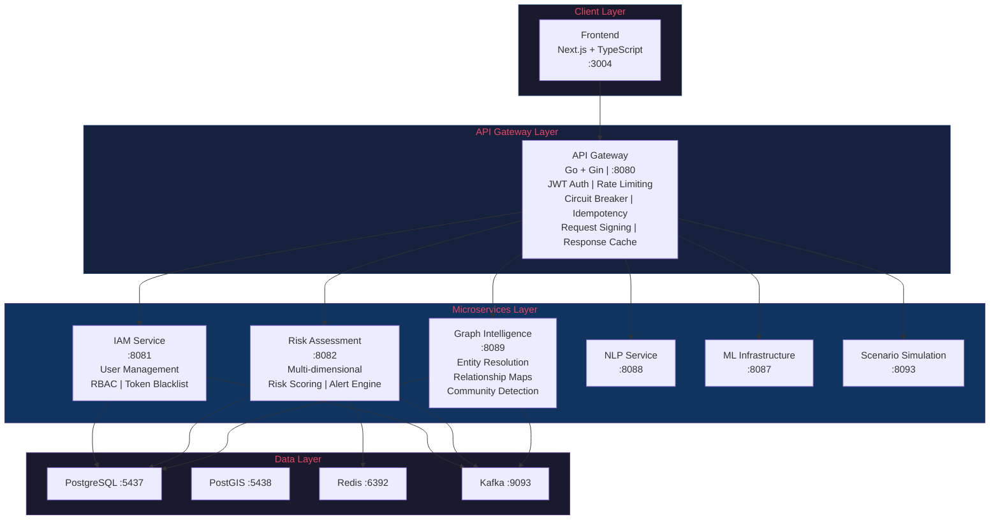
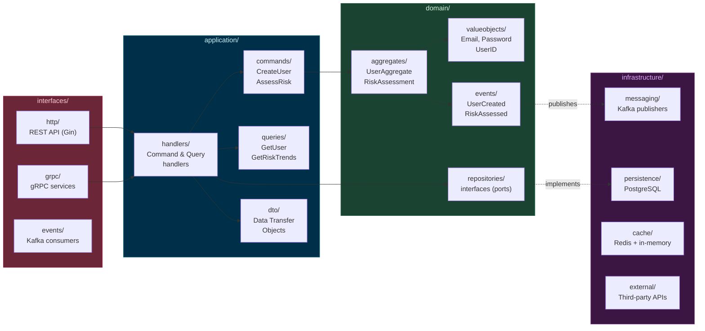
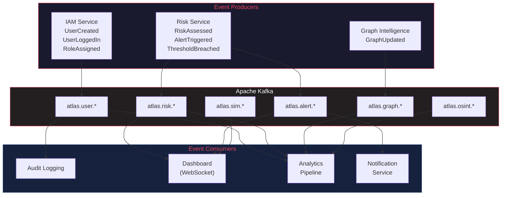
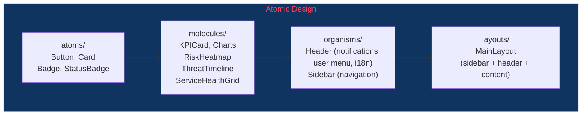
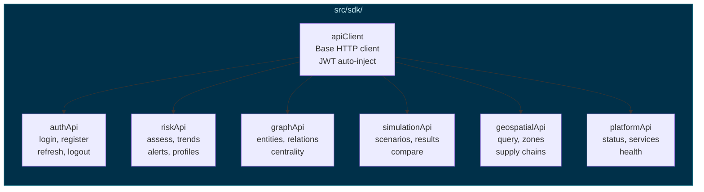
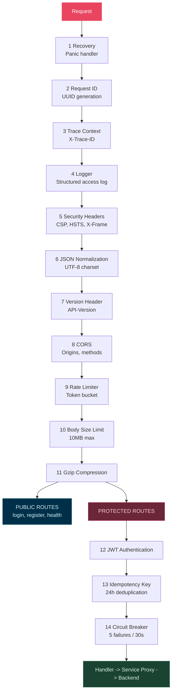
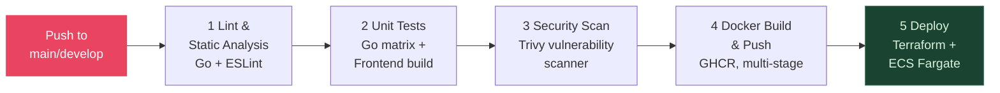

<div align="center">


# ATLAS Core API

### Plataforma de Inteligencia Estrategica

**Cloud-Native | DDD + CQRS | Event-Driven | Enterprise-Grade**

[]()
[]()
[]()
[]()
[]()
[]()

[]()
[]()
[]()
[]()
[]()
[]()
[]()

**29 Microsservicos** | **150+ Endpoints de API** | **35+ Containers Docker** | **3 Idiomas (i18n)**

[Inicio Rapido](#inicio-rapido) | [Arquitetura](#arquitetura) | [Manual da API](docs/API_MANUAL.md) | [Contribuindo](#contribuindo)

**[English](README.md)** | **[Espanol](README.es.md)**

</div>

---

## Sumario

- [Visao Geral](#visao-geral)
- [Arquitetura](#arquitetura)
  - [Visao Geral do Sistema](#visao-geral-do-sistema)
  - [Arquitetura DDD + CQRS](#arquitetura-ddd--cqrs)
  - [Arquitetura Orientada a Eventos](#arquitetura-orientada-a-eventos)
  - [Stack Tecnologica](#stack-tecnologica)
- [Aplicacao Frontend](#aplicacao-frontend)
- [Funcionalidades Enterprise](#funcionalidades-enterprise)
- [Primeiros Passos](#primeiros-passos)
- [Referencia da API](#referencia-da-api)
- [Autenticacao e Autorizacao](#autenticacao--autorizacao)
- [Catalogo de Eventos](#catalogo-de-eventos)
- [Registro de Servicos](#registro-de-servicos)
- [Schema do Banco de Dados](#schema-do-banco-de-dados)
- [Pipeline de Middleware](#pipeline-de-middleware)
- [Observabilidade](#observabilidade)
- [Infraestrutura e DevOps](#infraestrutura--devops)
- [Referencia de Configuracao](#referencia-de-configuracao)
- [Estrutura do Projeto](#estrutura-do-projeto)
- [Solucao de Problemas](#solucao-de-problemas)
- [Roadmap](#roadmap)
- [Contribuindo](#contribuindo)
- [Licenca](#licenca)

> **Manual da API**: Para a referencia completa de endpoints com exemplos de requisicao/resposta, consulte [docs/API_MANUAL.md](docs/API_MANUAL.md).

---

## Visao Geral

O ATLAS e uma **Plataforma de Inteligencia Estrategica** de nivel empresarial, construida para organizacoes que necessitam de analise de risco estrategico, simulacao de cenarios, inteligencia geoespacial e suporte a decisao em tempo quase real. Arquitetada com padroes de **Domain-Driven Design (DDD)**, **CQRS** e **Arquitetura Orientada a Eventos** em 29 microsservicos cloud-native, ela oferece:

- **Analise de Risco Multidimensional** nas dimensoes Operacional, Financeira, Reputacional, Geopolitica e de Conformidade
- **Pipeline de Machine Learning** com rastreamento de experimentos MLflow, servico de modelos, monitoramento de drift e explicabilidade (XAI)
- **Processamento de Linguagem Natural** para reconhecimento de entidades, analise de sentimento, classificacao e resumo de documentos
- **Inteligencia de Grafos** com mapeamento de relacionamentos, analise de centralidade, deteccao de comunidades e propagacao de risco
- **Simulacao de Cenarios** com metodos de Monte Carlo e modelagem baseada em agentes
- **Digital Twins** de infraestrutura, cadeia de suprimentos e sistemas economicos
- **Inteligencia Geoespacial** com consultas espaciais baseadas em PostGIS e mapeamento de cadeia de suprimentos
- **Conformidade Automatizada** com Policy-as-Code, auditoria continua e geracao de evidencias
- **Coleta OSINT** agregando inteligencia de fontes abertas de noticias, dados juridicos e fontes licenciadas

---

## Arquitetura

### Visao Geral do Sistema



### Stack Tecnologica

| Camada             | Tecnologia                                                     |
|--------------------|----------------------------------------------------------------|
| **API Gateway**    | Go 1.21, Gin, JWT, Circuit Breaker, Rate Limiter               |
| **Backend**        | Go (Gin), Python (FastAPI)                                     |
| **Frontend**       | Next.js 14, TypeScript, Tailwind CSS                           |
| **BD Principal**   | PostgreSQL 15 (Alpine) com pool de conexoes                    |
| **BD Geoespacial** | PostGIS 15-3.3 (Alpine)                                        |
| **Cache**          | Redis 7 (Alpine) com evicao LRU, persistencia AOF              |
| **Mensageria**     | Apache Kafka (Confluent 7.5) com Zookeeper                     |
| **ML/IA**          | MLflow, XGBoost, LSTM, Transformers                            |
| **Observabilidade**| Prometheus, OpenTelemetry (OTLP/gRPC), Logs JSON Estruturados  |
| **Infraestrutura** | Docker, Docker Compose, builds Alpine multi-stage              |

### Principios de Design

- **Domain-Driven Design**: Contextos delimitados com agregados, objetos de valor e eventos de dominio
- **CQRS**: Separacao de Responsabilidade Comando-Consulta para otimizacao de leitura/escrita
- **Orientado a Eventos**: Streaming de eventos via Kafka em todos os contextos delimitados
- **Registro de Servicos por Configuracao**: 29 servicos backend registrados via variaveis de ambiente
- **Padrao Circuit Breaker**: Sony gobreaker protegendo toda a comunicacao entre servicos
- **Degradacao Graciosa**: Fallback para cache em memoria quando o Redis esta indisponivel
- **Seguranca Zero-Trust**: Camadas de JWT + API Key + assinatura HMAC de requisicoes
- **Containers Nao-Root**: Todas as imagens Docker rodam como `appuser` sem privilegios (uid 1000)
- **Arquitetura Limpa**: `cmd/` > `interfaces/` > `application/` > `domain/` > `infrastructure/`

### Arquitetura DDD + CQRS

Cada microsservico Go segue Domain-Driven Design com separacao CQRS:



### Arquitetura Orientada a Eventos

Todos os eventos de dominio fluem atraves do Kafka com envelopes estruturados:



**Formato do Envelope de Evento:**
```json
{
  "event_id": "uuid-v4",
  "event_type": "atlas.risk.assessed",
  "aggregate_id": "entity-uuid",
  "timestamp": "2024-01-15T10:30:00Z",
  "version": 1,
  "source": "risk-assessment",
  "payload": { ... }
}
```

---

## Aplicacao Frontend

O frontend do ATLAS e um dashboard Next.js 14 construido com TypeScript, Tailwind CSS e Recharts. Ele fornece uma interface abrangente de inteligencia estrategica com design em tema escuro.

### Paginas e Funcionalidades

| Pagina | Rota | Descricao |
|--------|------|-----------|
| **Centro de Comando** | `/dashboard` | Monitoramento de ameacas em tempo real com faixa de KPIs, graficos de tendencia de incidentes, painel de status do sistema, alertas ativos com filtragem por severidade/categoria, modais de detalhes de alertas e controles de atualizacao automatica |
| **Analiticos** | `/analytics` | Analise multidimensional de ameacas com 3 abas (Visao Geral, Tendencias, Detalhamento), graficos de area/barra/pizza/radar, filtragem por periodo, exportacao CSV/JSON |
| **Geoespacial** | `/geospatial` | Mapa mundial interativo com 6 camadas configuraveis (infraestrutura, energia, cadeia de suprimentos, maritimo, zonas de risco, satelites), marcadores de ativos, controles de opacidade de camadas, modos 2D/3D/satelite, reproducao de linha do tempo |
| **Simulacoes** | `/simulations` | Assistente de cenarios multi-etapa com 6+ modelos, configuracao de parametros, execucao Monte Carlo com progresso em tempo real, analise de impacto em 7 dimensoes, visualizacao de linha do tempo, recomendacoes estrategicas |
| **Conformidade** | `/compliance` | Rastreamento regulatorio para GDPR, LGPD, SOC 2, ISO 27001, tabela de logs de auditoria, politicas de governanca de dados (criptografia, retencao, controle de acesso) |
| **Login** | `/login` | Autenticacao segura com validacao de formulario, tratamento de erros, credenciais de demonstracao |

### Stack Tecnologica do Frontend

| Camada | Tecnologia |
|--------|------------|
| **Framework** | Next.js 14 (App Router) |
| **Linguagem** | TypeScript 5.5 |
| **Estilizacao** | Tailwind CSS 3.4 |
| **Estado** | Zustand 4.5 (stores de auth, UI, dashboard, mapa, plataforma, ameacas, simulacao, geo) |
| **Estado do Servidor** | TanStack React Query 5.5 |
| **Graficos** | Recharts 2.12 |
| **Animacoes** | Framer Motion 11.3 |
| **Datas** | date-fns 3.6 |

### Internacionalizacao (i18n)

Suporte completo a multiplos idiomas com deteccao automatica do navegador e preferencias persistentes:

| Idioma | Locale | Status |
|--------|--------|--------|
| Ingles | `en` | Completo (padrao) |
| Portugues (Brasil) | `pt-BR` | Completo |
| Espanhol | `es` | Completo |

- Sistema de traducao baseado em contexto com hook `useI18n()` e funcao `t()`
- Suporte a chaves aninhadas (ex.: `t("dashboard.alerts.criticalInfra")`)
- Seletor de idioma no cabecalho com indicadores de bandeira
- Persistencia via LocalStorage (chave `atlas-locale`)
- Fallback para ingles para chaves ausentes
- Todas as 5 paginas da aplicacao totalmente internacionalizadas

### Arquitetura de Componentes



### Gerenciamento de Estado (Zustand Stores)

| Store | Finalidade |
|-------|------------|
| `useAuthStore` | Sessao do usuario, estado de autenticacao (persistido via localStorage) |
| `useUIStore` | Toggle da sidebar, tema, notificacoes |
| `useDashboardStore` | Intervalo de tempo, filtros de nivel de risco, intervalo de atualizacao |
| `useMapStore` | Viewport do mapa, camadas visiveis, feature selecionada |
| `usePlatformStore` | Status de saude dos servicos, ultima verificacao de saude |
| `useThreatStore` | Gerenciamento de eventos de ameaca, filtragem por severidade, confirmacao |
| `useSimulationStore` | Execucoes de simulacao, rastreamento de progresso, estado da execucao ativa |
| `useGeoStore` | Viewport do mapa, controles de camada, selecao de features, modo do mapa |

### SDK de API Tipado



### Hooks Customizados

| Hook | Finalidade |
|------|------------|
| `useAlerts` | Gerenciamento de alertas com filtragem, confirmacao, investigacao, descarte |
| `useAutoRefresh` | Atualizacao automatica configuravel com contagem regressiva e disparo manual |
| `useAuth` | Contexto de autenticacao (login, logout, estado do usuario) |
| `useI18n` | Funcao de traducao e gerenciamento de locale |

---

## Funcionalidades Enterprise

### Autenticacao e Seguranca

| Funcionalidade             | Descricao                                                           |
|----------------------------|---------------------------------------------------------------------|
| Autenticacao JWT           | Tokens assinados com HMAC-SHA256 com expiracao configuravel (padrao 1h) |
| Rotacao de Refresh Token   | Renovacao segura de tokens com refresh tokens de 7 dias             |
| Blacklist de Tokens        | Blacklist em memoria com limpeza em segundo plano (intervalos de 30 min) |
| Autenticacao por API Key   | Chaves com hash SHA256 com escopos, limites de taxa e listas de IP permitidos |
| Assinatura HMAC de Requisicoes | `X-Request-Signature` com protecao contra replay de 5 minutos   |
| Suporte a MFA              | Autenticacao multifator opcional baseada em TOTP                    |
| Bloqueio de Conta          | Maximo de tentativas configuravel (padrao 5) com duracao de bloqueio (15m) |
| RBAC                       | Controle de acesso baseado em funcoes (admin, analista, visualizador, operador) |
| Sistema de Permissoes      | Permissoes granulares recurso:acao com suporte a wildcard           |
| Politica de Senha          | Comprimento minimo, requisitos de caracteres especiais              |

### Resiliencia e Performance

| Funcionalidade         | Descricao                                                              |
|------------------------|------------------------------------------------------------------------|
| Circuit Breaker        | Circuit breakers por servico via Sony gobreaker (5 falhas max, 30s)    |
| Limitacao de Taxa      | RPS configuravel (padrao 100/s) + modo estrito (20/min) para sensivel  |
| Cache de Resposta      | Cache de respostas GET com chave SHA256 e backend Redis                |
| Chaves de Idempotencia | Deduplicacao de 24 horas para POST/PUT/PATCH via header `Idempotency-Key` |
| Pool de Conexoes       | HTTP: 100 max ociosas / 10 por host. PostgreSQL: 25 abertas / 10 ociosas |
| Limite de Tamanho do Body | 10MB maximo de corpo de requisicao com `http.MaxBytesReader`        |
| Compressao Gzip        | Compressao automatica de resposta via `gin-contrib/gzip`               |
| Desligamento Gracioso  | Timeout configuravel (padrao 30s) com dreno concorrente de servidores  |

### Observabilidade

| Funcionalidade       | Descricao                                                       |
|----------------------|-----------------------------------------------------------------|
| Metricas Prometheus  | Duracao de requisicoes HTTP, codigos de status, tamanhos de resposta em `:9090` |
| OpenTelemetry        | Rastreamento distribuido via OTLP/gRPC (substitui o Jaeger obsoleto) |
| Logs Estruturados    | Logs JSON via `zap` com correlacao por ID de requisicao         |
| Rastreamento de Requisicoes | Propagacao de `X-Request-ID` + `X-Trace-ID` entre servicos |
| Health Checks        | `/health`, `/healthz` (liveness), `/readyz` (readiness)        |
| Log de Acesso        | Log completo de acesso HTTP com latencia, status, tamanhos      |

### Middleware Enterprise

| Funcionalidade       | Descricao                                                        |
|----------------------|------------------------------------------------------------------|
| Headers de Seguranca | X-Frame-Options, CSP, HSTS, Permissions-Policy, Referrer-Policy  |
| CORS                 | Origens, metodos, headers e credenciais configuraveis            |
| Versionamento de API | Headers de resposta `API-Version` + `X-API-Version`             |
| Avisos de Depreciacao| Headers `Sunset` + `Deprecation` para endpoints obsoletos       |
| Endpoints Sensiveis  | Log aprimorado + desabilitacao de cache para operacoes sensiveis |
| Timeout de Requisicao| Headers de timeout configuravel por requisicao                   |
| Normalizacao JSON    | Imposicao de charset UTF-8 em todas as respostas                |

---

## Primeiros Passos

### Pre-requisitos

- Docker Desktop (Windows/Mac) ou Docker Engine + Compose (Linux)
- Git
- Minimo 8GB RAM, 20GB de espaco em disco livre
- Go 1.21+ (apenas para desenvolvimento local)

### Inicio Rapido

```bash
# Clonar o repositorio
git clone https://github.com/your-org/atlas-core-api.git
cd atlas-core-api

# Configurar ambiente
cp .env.example .env
# Edite .env com suas credenciais (altere JWT_SECRET para producao)

# Iniciar todos os servicos
docker compose up --build
```

### Endpoints dos Servicos

| Servico              | URL                          | Descricao                |
|----------------------|------------------------------|--------------------------|
| Frontend             | `http://localhost:3004`      | Dashboard Next.js        |
| API Gateway          | `http://localhost:8080`      | Ponto de entrada principal da API |
| Servico IAM          | `http://localhost:8084`      | Gerenciamento de identidade |
| Avaliacao de Risco   | `http://localhost:8086`      | Motor de pontuacao de risco |
| Inteligencia de Grafos| `http://localhost:8089`     | Analise de relacionamentos |
| Metricas Prometheus  | `http://localhost:9090`      | Metricas do gateway      |
| PostgreSQL           | `localhost:5437`             | Banco de dados principal |
| PostGIS              | `localhost:5438`             | Banco de dados geoespacial |
| Redis                | `localhost:6392`             | Cache e sessoes          |
| Kafka                | `localhost:9093`             | Streaming de eventos     |
| Zookeeper            | `localhost:2181`             | Coordenacao do Kafka     |

### Verificacao de Saude

```bash
# Saude do gateway
curl http://localhost:8080/health

# Probe de liveness (compativel com Kubernetes)
curl http://localhost:8080/healthz

# Probe de readiness
curl http://localhost:8080/readyz
```

---

## Referencia da API

> **Manual Completo da API**: Para a referencia completa de endpoints com exemplos de requisicao/resposta, exemplos de SDK (cURL, JavaScript, Python) e guia de integracao, consulte **[docs/API_MANUAL.md](docs/API_MANUAL.md)**.

**URL Base**: `http://localhost:8080/api/v1`

Todos os endpoints protegidos requerem:
```
Authorization: Bearer <jwt_token>
```

### Autenticacao

| Metodo | Endpoint               | Auth     | Descricao                      |
|--------|------------------------|----------|--------------------------------|
| POST   | `/auth/login`          | Publico  | Login com usuario/senha        |
| POST   | `/auth/register`       | Publico  | Registrar nova conta           |
| POST   | `/auth/refresh`        | Publico  | Atualizar token de acesso      |
| GET    | `/auth/validate`       | Publico  | Validar token                  |
| POST   | `/auth/logout`         | Bearer   | Logout (invalida o token)      |
| POST   | `/auth/change-password`| Bearer   | Alterar senha (sensivel)       |

#### Login

```bash
curl -X POST http://localhost:8080/api/v1/auth/login \
  -H "Content-Type: application/json" \
  -d '{"username": "admin", "password": "Admin@2024"}'
```

> **Credenciais de Demonstracao**: `admin` / `Admin@2024` (senha deve ter 8+ caracteres)

Resposta:
```json
{
  "access_token": "eyJhbGciOiJIUzI1NiIs...",
  "refresh_token": "eyJhbGciOiJIUzI1NiIs...",
  "token_type": "Bearer",
  "expires_in": 3600,
  "user": {
    "id": "uuid",
    "username": "admin",
    "email": "admin@atlas.com",
    "roles": ["admin"]
  }
}
```

#### Registro

```bash
curl -X POST http://localhost:8080/api/v1/auth/register \
  -H "Content-Type: application/json" \
  -d '{
    "username": "analyst01",
    "email": "analyst@atlas.com",
    "password": "SecurePass!123"
  }'
```

### Gerenciamento de Usuarios

| Metodo | Endpoint                       | Auth   | Descricao                  |
|--------|--------------------------------|--------|----------------------------|
| GET    | `/users/me`                    | Bearer | Obter perfil do usuario atual |
| GET    | `/users/:id`                   | Bearer | Obter usuario por ID       |
| PUT    | `/users/:id`                   | Bearer | Atualizar usuario (proprio ou admin) |
| DELETE | `/users/:id`                   | Admin  | Excluir usuario            |
| GET    | `/admin/users`                 | Admin  | Listar todos os usuarios (paginado) |

### Gerenciamento de Funcoes (Admin)

| Metodo | Endpoint                       | Auth  | Descricao                  |
|--------|--------------------------------|-------|----------------------------|
| GET    | `/admin/roles`                 | Admin | Listar todas as funcoes    |
| POST   | `/admin/roles`                 | Admin | Criar nova funcao          |
| POST   | `/admin/users/:id/roles/:roleId`  | Admin | Atribuir funcao ao usuario |
| DELETE | `/admin/users/:id/roles/:roleId`  | Admin | Remover funcao do usuario  |

### Ingestao de Dados

| Metodo | Endpoint                         | Descricao                    |
|--------|----------------------------------|------------------------------|
| GET    | `/ingestion/sources`             | Listar fontes de dados       |
| POST   | `/ingestion/sources`             | Criar nova fonte             |
| GET    | `/ingestion/sources/:id`         | Detalhes da fonte            |
| POST   | `/ingestion/sources/:id/data`    | Enviar dados para ingestao   |
| POST   | `/ingestion/sources/:id/trigger` | Disparar ingestao manual     |
| GET    | `/ingestion/status`              | Status geral de ingestao     |

### Normalizacao de Dados

| Metodo | Endpoint                           | Descricao               |
|--------|------------------------------------|-------------------------|
| GET    | `/normalization/rules`             | Listar regras de normalizacao |
| POST   | `/normalization/rules`             | Criar regra             |
| GET    | `/normalization/rules/:id`         | Detalhes da regra       |
| PUT    | `/normalization/rules/:id`         | Atualizar regra         |
| DELETE | `/normalization/rules/:id`         | Remover regra           |
| GET    | `/normalization/quality/:data_id`  | Metricas de qualidade do dataset |
| GET    | `/normalization/stats`             | Estatisticas agregadas  |

### Avaliacao de Risco

| Metodo | Endpoint                       | Descricao                     |
|--------|--------------------------------|-------------------------------|
| POST   | `/risks/assess`                | Avaliar risco de entidade     |
| GET    | `/risks/:id`                   | Obter avaliacao especifica    |
| GET    | `/risks/trends`                | Tendencias de risco ao longo do tempo |
| GET    | `/risks/entities/:entity_id`   | Avaliacoes por entidade       |
| POST   | `/risks/alerts`                | Configurar alertas de risco   |
| GET    | `/risks/profiles`              | Perfis executivos de risco    |

### Auditoria e Conformidade

| Metodo | Endpoint                       | Descricao                  |
|--------|--------------------------------|----------------------------|
| POST   | `/audit/events`                | Criar evento de auditoria  |
| GET    | `/audit/logs`                  | Listar logs de auditoria   |
| GET    | `/audit/logs/:id`              | Detalhes do log            |
| GET    | `/audit/compliance/report`     | Relatorio de conformidade  |
| GET    | `/compliance/status`           | Conformidade consolidada   |
| GET    | `/compliance/lineage/:id`      | Rastreamento de linhagem de dados |

### Infraestrutura de ML

| Metodo | Endpoint                          | Descricao               |
|--------|-----------------------------------|-------------------------|
| GET    | `/ml/models`                      | Listar modelos registrados |
| POST   | `/ml/models`                      | Registrar modelo        |
| POST   | `/ml/models/:model_name/predict`  | Executar predicao       |
| GET    | `/ml/experiments`                 | Listar experimentos     |
| GET    | `/ml/health`                      | Saude da infraestrutura de ML |

### Servicos de NLP

| Metodo | Endpoint              | Descricao                    |
|--------|-----------------------|------------------------------|
| POST   | `/nlp/ner`            | Reconhecimento de Entidades Nomeadas |
| POST   | `/nlp/sentiment`      | Analise de sentimento        |
| POST   | `/nlp/classify`       | Classificacao de texto       |
| POST   | `/nlp/summarize`      | Resumo de documentos         |

### Inteligencia de Grafos

| Metodo | Endpoint                                | Descricao                |
|--------|-----------------------------------------|--------------------------|
| POST   | `/graph/entities/resolve`               | Resolucao de entidades   |
| GET    | `/graph/entities/:id/relationships`     | Relacionamentos da entidade |
| GET    | `/graph/entities/:id/risk-propagation`  | Caminhos de propagacao de risco |
| GET    | `/graph/analytics/centrality`           | Analise de centralidade  |
| GET    | `/graph/analytics/communities`          | Deteccao de comunidades  |

### Inteligencia Geoespacial

| Metodo | Endpoint                        | Descricao               |
|--------|---------------------------------|-------------------------|
| POST   | `/geospatial/query`             | Consulta espacial       |
| GET    | `/geospatial/zones`             | Listagem de zonas/camadas |
| POST   | `/geospatial/context`           | Contexto de localizacao |
| GET    | `/geospatial/supply-chains`     | Mapas de cadeia de suprimentos |
| POST   | `/geospatial/supply-chains`     | Criar mapa de cadeia de suprimentos |

### OSINT e Noticias

| Metodo | Endpoint              | Descricao                  |
|--------|-----------------------|----------------------------|
| GET    | `/osint/analysis`     | Analise OSINT              |
| GET    | `/osint/signals`      | Sinais de inteligencia     |
| GET    | `/news/articles`      | Artigos de noticias agregados |
| GET    | `/news/sources`       | Fontes de noticias         |
| POST   | `/briefings/generate` | Gerar briefing executivo   |

### Simulacao de Cenarios

| Metodo | Endpoint                              | Descricao               |
|--------|---------------------------------------|-------------------------|
| POST   | `/simulations/scenarios`              | Criar cenario           |
| GET    | `/simulations/:simulation_id`         | Obter resultados da simulacao |
| GET    | `/simulations/:simulation_id/results` | Resultados detalhados   |
| POST   | `/simulations/compare`                | Comparar cenarios       |

### Endpoints Enterprise

| Area             | Metodo | Endpoint                        | Descricao                  |
|------------------|--------|---------------------------------|----------------------------|
| XAI              | POST   | `/xai/explain`                  | Explicar decisao do modelo |
| XAI              | POST   | `/xai/batch`                    | Explicacoes em lote        |
| War-Gaming       | POST   | `/wargaming/scenarios`          | Criar cenario de war-game  |
| Digital Twins    | GET    | `/twins`                        | Listar digital twins       |
| Digital Twins    | POST   | `/twins`                        | Criar digital twin         |
| Impacto de Politica | POST | `/policy/analyze`              | Analise de impacto de politica |
| Multi-Regiao     | GET    | `/regions`                      | Listar regioes             |
| Residencia de Dados | GET | `/residency/policies`           | Politicas de residencia de dados |
| ML Federado      | POST   | `/federated/training/start`     | Iniciar treinamento federado |
| API Mobile       | GET    | `/mobile/dashboard`             | Dados do dashboard mobile  |
| Conformidade     | GET    | `/compliance/automation/status` | Status da automacao        |

### Status da Plataforma

| Metodo | Endpoint                  | Descricao                             |
|--------|---------------------------|---------------------------------------|
| GET    | `/platform/status`        | Status agregado de todos os servicos  |
| GET    | `/platform/services`      | Listar servicos registrados           |

### Idempotencia

Para operacoes mutaveis (POST, PUT, PATCH), inclua uma chave de idempotencia:

```bash
curl -X POST http://localhost:8080/api/v1/risks/assess \
  -H "Authorization: Bearer <token>" \
  -H "Idempotency-Key: unique-request-id-123" \
  -H "Content-Type: application/json" \
  -d '{"entity_id": "...", "entity_type": "organization"}'
```

Respostas repetidas incluem `X-Idempotent-Replayed: true`.

---

## Autenticacao e Autorizacao

### Estrutura do Token JWT

```json
{
  "user_id": "uuid",
  "username": "admin",
  "email": "admin@atlas.com",
  "roles": ["admin"],
  "permissions": ["risk:read", "risk:write", "user:manage"],
  "mfa_verified": false,
  "exp": 1700000000,
  "iat": 1699996400
}
```

### Funcoes Padrao

| Funcao     | Descricao                               |
|------------|-----------------------------------------|
| `admin`    | Acesso total ao sistema, gerenciamento de usuarios |
| `analyst`  | Acesso de leitura/escrita a funcoes de analise |
| `viewer`   | Acesso somente leitura                  |
| `operator` | Acesso a gerenciamento operacional      |

### Permissoes Padrao

| Permissao               | Recurso       | Acao   |
|-------------------------|---------------|--------|
| `risk:read`             | risk          | read   |
| `risk:write`            | risk          | write  |
| `user:read`             | user          | read   |
| `user:manage`           | user          | manage |
| `audit:read`            | audit         | read   |
| `data:ingest`           | data          | ingest |
| `model:predict`         | model         | predict|

### Autenticacao por API Key

Para comunicacao entre servicos:

```bash
curl http://localhost:8080/api/v1/risks/trends \
  -H "X-API-Key: your-api-key-here"
```

### Assinatura HMAC de Requisicoes

Para endpoints de alta seguranca:

```bash
# Signature = HMAC-SHA256(secret, "{timestamp}.{path}.{body}")
curl http://localhost:8080/api/v1/risks/assess \
  -H "X-Request-Signature: <hmac-signature>" \
  -H "X-Request-Timestamp: <unix-timestamp>"
```

---

## Registro de Servicos

O API Gateway faz proxy de requisicoes para 29 servicos backend atraves de um registro orientado por configuracao. Cada URL de servico e configuravel via variaveis de ambiente.

| Servico                      | URL Interna                            | Variavel de Ambiente                      |
|------------------------------|----------------------------------------|-------------------------------------------|
| Servico IAM                  | `http://iam-service:8081`              | `SERVICE_IAM_SERVICE_URL`                 |
| Avaliacao de Risco           | `http://risk-assessment:8082`          | `SERVICE_RISK_ASSESSMENT_URL`             |
| Agregador de Noticias        | `http://news-aggregator:8083`          | `SERVICE_NEWS_AGGREGATOR_URL`             |
| Servico de Ingestao          | `http://ingestion-service:8084`        | `SERVICE_INGESTION_SERVICE_URL`           |
| Servico de Normalizacao      | `http://normalization-service:8085`    | `SERVICE_NORMALIZATION_SERVICE_URL`       |
| Servico de Auditoria         | `http://audit-logging:8086`            | `SERVICE_AUDIT_SERVICE_URL`              |
| Infraestrutura de ML         | `http://ml-infrastructure:8087`        | `SERVICE_ML_INFRASTRUCTURE_URL`           |
| Servico de NLP               | `http://nlp-service:8088`              | `SERVICE_NLP_SERVICE_URL`                 |
| Inteligencia de Grafos       | `http://graph-intelligence:8089`       | `SERVICE_GRAPH_INTELLIGENCE_URL`          |
| Servico XAI                  | `http://xai-service:8090`              | `SERVICE_XAI_SERVICE_URL`                 |
| Servico de Modelos           | `http://model-serving:8091`            | `SERVICE_MODEL_SERVING_URL`               |
| Monitoramento de Modelos     | `http://model-monitoring:8092`         | `SERVICE_MODEL_MONITORING_URL`            |
| Simulacao de Cenarios        | `http://scenario-simulation:8093`      | `SERVICE_SCENARIO_SIMULATION_URL`         |
| War-Gaming                   | `http://war-gaming:8094`               | `SERVICE_WAR_GAMING_URL`                  |
| Digital Twins                | `http://digital-twins:8095`            | `SERVICE_DIGITAL_TWINS_URL`               |
| Impacto de Politica          | `http://policy-impact:8096`            | `SERVICE_POLICY_IMPACT_URL`               |
| Multi-Regiao                 | `http://multi-region:8097`             | `SERVICE_MULTI_REGION_URL`                |
| Residencia de Dados          | `http://data-residency:8098`           | `SERVICE_DATA_RESIDENCY_URL`              |
| Aprendizado Federado         | `http://federated-learning:8099`       | `SERVICE_FEDERATED_LEARNING_URL`          |
| API Mobile                   | `http://mobile-api:8100`               | `SERVICE_MOBILE_API_URL`                  |
| Automacao de Conformidade    | `http://compliance-automation:8101`    | `SERVICE_COMPLIANCE_AUTOMATION_URL`       |
| Otimizacao de Performance    | `http://performance-optimization:8102` | `SERVICE_PERFORMANCE_OPTIMIZATION_URL`    |
| Otimizacao de Custos         | `http://cost-optimization:8103`        | `SERVICE_COST_OPTIMIZATION_URL`           |
| P&D Avancado                 | `http://advanced-rd:8104`              | `SERVICE_ADVANCED_RD_URL`                 |
| Certificacao de Seguranca    | `http://security-certification:8105`   | `SERVICE_SECURITY_CERTIFICATION_URL`      |
| Melhoria Continua            | `http://continuous-improvement:8106`   | `SERVICE_CONTINUOUS_IMPROVEMENT_URL`      |
| Servico de Entidades         | `http://entity-service:8107`           | `SERVICE_ENTITY_SERVICE_URL`              |
| Servico Geoespacial          | `http://geospatial-service:8108`       | `SERVICE_GEOSPATIAL_SERVICE_URL`          |
| Servico de Inteligencia      | `http://intelligence-service:8109`     | `SERVICE_INTELLIGENCE_SERVICE_URL`        |

---

## Schema do Banco de Dados

### Tabelas Principais (Migracao 000001)

```sql
-- IAM
users (id UUID PK, username UNIQUE, email UNIQUE, password_hash, is_active, is_verified, last_login_at)
roles (id UUID PK, name UNIQUE, description)
permissions (id UUID PK, name UNIQUE, resource, action, description)
user_roles (user_id FK, role_id FK, composite PK)
role_permissions (role_id FK, permission_id FK)

-- Risk Assessment
risk_assessments (id UUID PK, entity_id, entity_type, overall_score, operational_score,
                  financial_score, reputational_score, geopolitical_score, compliance_score)
risk_alerts (id UUID PK, assessment_id FK, severity ENUM, is_resolved, resolved_by)

-- Audit & Compliance
audit_logs (id UUID PK, user_id, action, resource, resource_id, ip_address, user_agent, details JSONB)
compliance_events (id UUID PK, event_type, regulation, status, evidence JSONB)

-- Data Ingestion
data_sources (id UUID PK, name UNIQUE, source_type, config JSONB, is_active)
ingestion_runs (id UUID PK, source_id FK, status, records_processed, records_failed, error_message)
```

### Tabelas Enterprise (Migracao 000003)

```sql
-- API Key Management
api_keys (id UUID PK, key_hash UNIQUE, key_prefix, owner_id FK, scopes TEXT[],
          rate_limit_rps, allowed_ips TEXT[], expires_at)

-- Token & Session Management
token_blacklist (id UUID PK, token_hash, user_id FK, reason, expires_at)
login_attempts (id UUID PK, username, ip_address, success BOOL, user_agent, failure_reason)
user_sessions (id UUID PK, user_id FK, token_hash, ip_address, device_info JSONB, expires_at)

-- Webhook System
webhook_subscriptions (id UUID PK, url, secret, events TEXT[], owner_id FK, retry_count, timeout_seconds)
webhook_deliveries (id UUID PK, subscription_id FK, event_type, payload JSONB, response_status, success)

-- Feature Flags
feature_flags (id UUID PK, name UNIQUE, is_enabled, rules JSONB, rollout_percentage 0-100, created_by FK)
```

### Tabelas Geoespaciais (Migracao 000002)

Tabelas habilitadas com PostGIS para consultas espaciais, gerenciamento de zonas e mapeamento geografico de cadeia de suprimentos.

### Dados Iniciais

A migracao inicial inclui:
- **4 funcoes**: admin, analyst, viewer, operator
- **7 permissoes**: risk:read, risk:write, user:read, user:manage, audit:read, data:ingest, model:predict
- **Usuario admin**: `admin` / `admin@atlas.com`

---

## Pipeline de Middleware

As requisicoes fluem pela seguinte cadeia de middleware em ordem:



---

## Observabilidade

### Metricas Prometheus

Disponiveis em `http://localhost:9090/metrics`:

- `http_requests_total` - Total de requisicoes HTTP por metodo, caminho, status
- `http_request_duration_seconds` - Histograma de latencia de requisicoes
- `http_response_size_bytes` - Histograma de tamanho de respostas

### Logs Estruturados

Todos os servicos utilizam `zap` para logs JSON estruturados:

```json
{
  "level": "info",
  "msg": "HTTP Request",
  "method": "POST",
  "path": "/api/v1/auth/login",
  "status": 200,
  "latency": "12.345ms",
  "ip": "172.28.0.1",
  "request_id": "550e8400-e29b-41d4-a716-446655440000",
  "request_size": 64,
  "response_size": 512
}
```

### Rastreamento Distribuido

OpenTelemetry com exportador OTLP/gRPC (configuravel):

```bash
TRACING_ENABLED=true
JAEGER_ENDPOINT=localhost:4317  # OTLP gRPC endpoint
TRACING_SAMPLING_FRACTION=0.1
```

### Health Checks

Cada servico implementa health checks Docker:

| Endpoint   | Finalidade                           |
|------------|--------------------------------------|
| `/health`  | Saude completa com verificacao de dependencias |
| `/healthz` | Probe de liveness do Kubernetes      |
| `/readyz`  | Probe de readiness do Kubernetes     |

---

## Referencia de Configuracao

Toda a configuracao e gerenciada via variaveis de ambiente. Consulte `.env.example` para a referencia completa.

### Configuracoes Criticas

| Variavel              | Padrao                   | Descricao                            |
|-----------------------|--------------------------|--------------------------------------|
| `ENVIRONMENT`         | `development`            | Ambiente (development/production)    |
| `JWT_SECRET`          | `change-me-in-production`| **Deve ser alterado em producao**    |
| `POSTGRES_PASSWORD`   | `atlas_dev`              | Senha do banco de dados              |
| `SERVER_PORT`         | `8080`                   | Porta do API Gateway                 |

### Servidor

| Variavel                  | Padrao  | Descricao              |
|---------------------------|---------|------------------------|
| `SERVER_HOST`             | `0.0.0.0` | Endereco de bind    |
| `SERVER_READ_TIMEOUT`     | `30s`   | Timeout de leitura     |
| `SERVER_WRITE_TIMEOUT`    | `30s`   | Timeout de escrita     |
| `SERVER_IDLE_TIMEOUT`     | `120s`  | Timeout de ociosidade  |
| `SERVER_SHUTDOWN_TIMEOUT` | `30s`   | Desligamento gracioso  |
| `SERVER_GRACEFUL_SHUTDOWN`| `true`  | Habilitar desligamento gracioso |

### Autenticacao

| Variavel                   | Padrao  | Descricao                  |
|----------------------------|---------|----------------------------|
| `JWT_EXPIRATION`           | `15m`   | TTL do token de acesso     |
| `REFRESH_TOKEN_EXPIRATION` | `168h`  | TTL do refresh token (7 dias) |
| `MAX_LOGIN_ATTEMPTS`       | `5`     | Max tentativas de login falhas |
| `LOCKOUT_DURATION`         | `15m`   | Duracao do bloqueio de conta |
| `PASSWORD_MIN_LENGTH`      | `8`     | Comprimento minimo da senha |
| `PASSWORD_REQUIRE_SPECIAL` | `true`  | Exigir caracteres especiais |
| `MFA_REQUIRED`             | `false` | Exigir MFA                 |

### Cache

| Variavel              | Padrao                   | Descricao                |
|-----------------------|--------------------------|--------------------------|
| `CACHE_TYPE`          | `redis`                  | Backend de cache         |
| `CACHE_TTL`           | `1h`                     | TTL padrao do cache      |
| `REDIS_URL`           | `redis://localhost:6392` | URL de conexao do Redis  |
| `CACHE_MAX_SIZE`      | `1000`                   | Max entradas em memoria  |
| `CACHE_EVICTION_POLICY`| `lru`                   | Politica de evicao       |

### Limitacao de Taxa

| Variavel           | Padrao  | Descricao                |
|--------------------|---------|--------------------------|
| `RATE_LIMIT_ENABLED`| `true` | Habilitar limitacao de taxa |
| `RATE_LIMIT_RPS`   | `100`   | Requisicoes por segundo  |
| `RATE_LIMIT_BURST` | `50`    | Permissao de burst       |

### CORS

| Variavel                | Padrao                               | Descricao              |
|-------------------------|--------------------------------------|------------------------|
| `CORS_ENABLED`          | `true`                               | Habilitar CORS         |
| `CORS_ALLOWED_ORIGINS`  | `http://localhost:3004`              | Origens permitidas (CSV) |
| `CORS_ALLOWED_METHODS`  | `GET,POST,PUT,DELETE,OPTIONS`        | Metodos permitidos (CSV) |
| `CORS_ALLOW_CREDENTIALS`| `true`                               | Permitir credenciais   |
| `CORS_MAX_AGE`          | `86400`                              | Cache de preflight (seg) |

### Banco de Dados

| Variavel               | Padrao      | Descricao                 |
|------------------------|-------------|---------------------------|
| `DATABASE_URL`         | (composta)  | URL completa do PostgreSQL |
| `DATABASE_MAX_CONNECTIONS`| `25`     | Max conexoes abertas      |
| `DATABASE_MIN_CONNECTIONS`| `5`      | Min conexoes ociosas      |
| `DATABASE_SSLMODE`     | `disable`   | Modo SSL                  |
| `DATABASE_LOG_QUERIES` | `false`     | Registrar consultas SQL   |

---

## Estrutura do Projeto

```
atlas-core-api/
|-- docker-compose.yml              # Orquestracao de servicos
|-- .env.example                    # Template de configuracao de ambiente
|-- README.md                       # Este arquivo (Ingles)
|-- README.pt-BR.md                 # Portugues (Brasil)
|-- README.es.md                    # Espanhol
|-- migrations/
|   |-- 000001_init_schema.up.sql   # Tabelas principais (IAM, risco, auditoria, ingestao)
|   |-- 000002_geospatial.up.sql    # Extensoes PostGIS
|   |-- 000003_enterprise_features.up.sql  # API keys, sessoes, webhooks, flags
|
|-- services/
|   |-- api-gateway/                # API Gateway (Go, Gin) - :8080
|   |   |-- cmd/main.go
|   |   |-- internal/
|   |   |   |-- api/
|   |   |   |   |-- handlers/       # Handlers de auth e health check
|   |   |   |   |-- middleware/      # Auth, cache, CORS, rate limit, idempotencia, seguranca
|   |   |   |   |-- router/         # Registro de rotas por configuracao (29 servicos)
|   |   |   |-- infrastructure/
|   |   |       |-- cache/           # Cache Redis + em memoria
|   |   |       |-- config/          # Configuracao baseada em ambiente
|   |   |       |-- observability/
|   |   |       |   |-- metrics/     # Instrumentacao Prometheus
|   |   |       |   |-- tracing/     # OpenTelemetry OTLP/gRPC
|   |   |       |-- resilience/
|   |   |           |-- circuitbreaker/  # Pool Sony gobreaker
|   |   |-- Dockerfile
|   |
|   |-- iam/                        # Identidade e Gerenciamento de Acesso (Go, DDD+CQRS) - :8081
|   |   |-- cmd/main.go
|   |   |-- internal/
|   |   |   |-- domain/
|   |   |   |   |-- aggregates/     # UserAggregate (raiz do agregado)
|   |   |   |   |-- valueobjects/   # Email, HashedPassword, UserID
|   |   |   |   |-- events/         # UserCreated, UserLoggedIn, LoginFailed
|   |   |   |   |-- repositories/   # UserRepository, RoleRepository (interfaces)
|   |   |   |-- application/
|   |   |   |   |-- commands/       # CreateUserCommand, LoginUserCommand
|   |   |   |   |-- queries/        # GetUserQuery, ListUsersQuery
|   |   |   |   |-- handlers/       # CreateUserHandler, LoginUserHandler
|   |   |   |   |-- dto/            # UserDTO, AuthTokensDTO
|   |   |   |-- infrastructure/
|   |   |   |   |-- persistence/    # Implementacoes de repositorio PostgreSQL
|   |   |   |   |-- messaging/      # Publicador de eventos Kafka
|   |   |   |   |-- config/         # Configuracao baseada em ambiente
|   |   |   |-- api/handlers/       # Handlers HTTP (Gin)
|   |   |   |-- api/middleware/      # Auth JWT, guards de funcao/permissao
|   |   |-- Dockerfile
|   |
|   |-- risk-assessment/            # Avaliacao de Risco (Go, DDD+CQRS) - :8082
|   |-- ingestion/                  # Ingestao de Dados (Go) + Kafka
|   |-- normalization/              # Normalizacao de Dados (Go) + Kafka
|   |-- audit-logging/              # Log de Auditoria (Go) + Kafka
|   |-- graph-intelligence/         # Inteligencia de Grafos (Go) - :8089
|   |-- frontend/                   # Dashboard Next.js 14 - :3000
|   |   |-- src/
|   |   |   |-- app/                # Paginas (dashboard, analiticos, geoespacial, simulacoes, conformidade, login)
|   |   |   |-- components/
|   |   |   |   |-- atoms/          # Button, Card, Badge, StatusBadge
|   |   |   |   |-- molecules/      # KPICard, Charts, RiskHeatmap, ThreatTimeline, ServiceHealthGrid
|   |   |   |   |-- organisms/      # Header, Sidebar (com seletor de idioma i18n)
|   |   |   |   |-- layouts/        # MainLayout (sidebar + header + conteudo)
|   |   |   |-- contexts/          # AuthContext (gerenciamento de sessao JWT)
|   |   |   |-- hooks/             # useAlerts, useAutoRefresh, useAuth, useI18n
|   |   |   |-- i18n/              # Internacionalizacao (en, pt-BR, es) - 500+ chaves
|   |   |   |-- sdk/               # SDK Tipado: apiClient, authApi, riskApi, graphApi, simulationApi, geospatialApi, platformApi
|   |   |   |-- store/             # Stores Zustand (auth, UI, dashboard, mapa, plataforma, ameacas, simulacao, geo)
|   |   |   |-- types/             # Definicoes TypeScript
|   |   |   |-- utils/             # Funcoes utilitarias (formatDate, cn, etc.)
|   |   |-- Dockerfile
|   |
|   |-- ml-infrastructure/          # Pipeline de ML (Python)
|   |-- nlp-service/                # Processamento de NLP (Python)
|   |-- xai-service/                # IA Explicavel (Python)
|   |-- model-serving/              # Servico de Modelos (Python)
|   |-- model-monitoring/           # Monitoramento de Modelos (Python)
|   |-- scenario-simulation/        # Simulacao Monte Carlo (Python)
|   |-- war-gaming/                 # Motor de War-Gaming (Python)
|   |-- digital-twins/              # Digital Twins (Python)
|   |-- policy-impact/              # Analise de Impacto de Politicas (Python)
|   |-- multi-region/               # Controlador Multi-Regiao (Python)
|   |-- data-residency/             # Residencia de Dados (Python)
|   |-- federated-learning/         # Aprendizado Federado (Python)
|   |-- mobile-api/                 # API Mobile (Python)
|   |-- compliance-automation/      # Automacao de Conformidade (Python)
|   |-- performance-optimization/   # Otimizacao de Performance (Python)
|   |-- cost-optimization/          # Otimizacao de Custos (Python)
|   |-- advanced-rd/                # P&D Avancado (Python)
|   |-- security-certification/     # Certificacao de Seguranca (Python)
|   |-- continuous-improvement/     # Melhoria Continua (Python)
|
|-- pkg/
|   |-- events/                      # Schemas de eventos Kafka compartilhados (Go)
|       |-- events.go                # Envelope de evento, constantes de topico, tipos de payload
|
|-- infrastructure/
|   |-- terraform/                   # Infraestrutura AWS (ECS, RDS, Redis, MSK)
|       |-- main.tf
|       |-- variables.tf
|       |-- outputs.tf
|
|-- .github/
|   |-- workflows/
|       |-- ci.yml                   # Pipeline CI/CD (lint, teste, seguranca, build, deploy)
|
|-- docs/
|   |-- atlas-logo.svg              # Logo/favicon do projeto
|   |-- events/README.md            # Documentacao do catalogo de eventos
|   |-- API_MANUAL.md               # Referencia completa de endpoints da API
|   |-- PHASE_1_MVP.md
|   |-- PHASE_2_ANALYTICS.md
|   |-- PHASE_3_DECISION_SUPPORT.md
|   |-- PHASE_4_STRATEGIC_PLATFORM.md
|   |-- PHASE_5_OPTIMIZATION.md
|   |-- AI_ML_STRATEGY.md
```

---

## Catalogo de Eventos

Todos os eventos de dominio sao publicados no Kafka com ordenacao garantida por agregado.

| Topico | Produtor | Consumidores | Descricao |
|--------|----------|--------------|-----------|
| `atlas.user.created` | IAM | Auditoria, Notificacao | Registro de novo usuario |
| `atlas.user.logged_in` | IAM | Auditoria, Analiticos | Login bem-sucedido |
| `atlas.user.login_failed` | IAM | Seguranca, Auditoria | Tentativa de login falha |
| `atlas.user.role_assigned` | IAM | Auditoria, Notificacao | Atribuicao de funcao |
| `atlas.user.deactivated` | IAM | Auditoria, Limpeza | Desativacao de conta |
| `atlas.risk.assessed` | Avaliacao de Risco | Dashboard, Analiticos | Avaliacao de risco concluida |
| `atlas.alert.triggered` | Avaliacao de Risco | Notificacao, Dashboard | Limite de risco ultrapassado |
| `atlas.alert.resolved` | Avaliacao de Risco | Dashboard, Auditoria | Resolucao de alerta |
| `atlas.simulation.completed` | Simulacao de Cenarios | Dashboard, Analiticos | Simulacao finalizada |
| `atlas.osint.collected` | Agregador de Noticias | NLP, Risco | Novos dados de inteligencia |
| `atlas.nlp.analyzed` | Servico NLP | Risco, Grafos | Resultado de analise NLP |
| `atlas.graph.updated` | Inteligencia de Grafos | Risco, Dashboard | Mudanca na topologia do grafo |
| `atlas.compliance.violation` | Conformidade | Auditoria, Notificacao | Violacao de conformidade |
| `atlas.ingestion.completed` | Ingestao | Normalizacao, Auditoria | Lote de ingestao de dados |

**Particionamento**: Eventos de usuario por `user_id`, eventos de risco por `entity_id`, alertas por `alert_id`.

---

## Infraestrutura e DevOps

### Pipeline CI/CD (GitHub Actions)



### Infraestrutura Terraform

Infraestrutura AWS pronta para producao:

| Recurso | Servico | Configuracao |
|---------|---------|--------------|
| **Computacao** | ECS Fargate | Auto-scaling, instancias Spot |
| **Banco de Dados** | RDS PostgreSQL 15 | Multi-AZ, criptografado, insights de performance |
| **Cache** | ElastiCache Redis 7 | Modo cluster, criptografia em repouso |
| **Mensageria** | MSK (Kafka) | 3 brokers, TLS, logs CloudWatch |
| **Rede** | VPC | 3 AZs, sub-redes publicas/privadas, NAT Gateway |
| **Monitoramento** | CloudWatch | Insights de container, grupos de log, alarmes |

```bash
# Implantar infraestrutura
cd infrastructure/terraform
terraform init
terraform plan -var="environment=production"
terraform apply
```

---

## Solucao de Problemas

### Conflitos de Porta

As portas padrao foram escolhidas para evitar conflitos comuns. Se voce tiver servicos rodando nestas portas, atualize o `docker-compose.yml`:

| Servico    | Porta Host Padrao | Porta do Container |
|------------|-------------------|--------------------|
| PostgreSQL | 5437              | 5432               |
| PostGIS    | 5438              | 5432               |
| Redis      | 6392              | 6379               |
| API Gateway| 8080              | 8080               |
| IAM        | 8084              | 8081               |
| Risk       | 8086              | 8082               |
| Graph Intel| 8089              | 8089               |
| Frontend   | 3004              | 3000               |
| Kafka      | 9093              | 9092               |
| Zookeeper  | 2181              | 2181               |
| Metricas   | 9090              | 9090               |

Para verificar quais portas estao em uso:

```bash
# Windows
netstat -ano | findstr LISTENING

# Linux/Mac
sudo lsof -i -P -n | grep LISTEN
```

### Erros de Build Docker

```bash
# Limpar cache de modulos Go para um servico especifico
cd services/<service-name>
go clean -modcache
go mod tidy
go build ./...

# Rebuild completo do Docker
docker compose down -v
docker builder prune -a -f
docker compose up --build
```

### Problemas de Comunicacao entre Servicos

```bash
# Verificar status dos servicos
docker compose ps

# Visualizar logs dos servicos
docker compose logs -f <service-name>

# Verificar conectividade de rede
docker compose exec api-gateway wget -q --spider http://iam-service:8081/health

# Verificar se todos os servicos estao na mesma rede
docker network inspect atlas-core-api_atlas-network
```

### Problemas de Banco de Dados

```bash
# Conectar ao PostgreSQL
docker compose exec postgres psql -U atlas -d atlas

# Executar migracoes manualmente
docker compose exec postgres psql -U atlas -d atlas -f /docker-entrypoint-initdb.d/000001_init_schema.up.sql

# Verificar saude do banco de dados
docker compose exec postgres pg_isready -U atlas -d atlas
```

### Problemas de Cache Redis

```bash
# Conectar ao CLI do Redis
docker compose exec redis redis-cli -p 6379

# Verificar saude do Redis
docker compose exec redis redis-cli ping

# Limpar cache (apenas desenvolvimento)
docker compose exec redis redis-cli FLUSHALL
```

---

## Roadmap

### Fase 1 -- Fundacao e Servicos Principais (Atual)
- Ingestao de Dados, Normalizacao, Avaliacao de Risco, Log de Auditoria
- IAM com RBAC, autenticacao JWT, blacklist de tokens
- API Gateway com pipeline de middleware enterprise
- Infraestrutura PostgreSQL, Redis, Kafka

### Fase 2 -- Analiticos Avancados
- Infraestrutura de ML com rastreamento de experimentos MLflow
- Servico NLP (NER, Sentimento, Classificacao, Resumo)
- Inteligencia de Grafos (centralidade, comunidades, propagacao de risco)
- IA Explicavel (XAI) com processamento em lote
- Servico e Monitoramento de Modelos com deteccao de drift

### Fase 3 -- Suporte a Decisao
- Simulacao de Cenarios (Monte Carlo, modelagem baseada em agentes)
- Motor de War-Gaming Defensivo
- Digital Twins de infraestrutura e cadeias de suprimentos
- Analise de Impacto de Politicas

### Fase 4 -- Plataforma Estrategica
- Arquitetura Multi-Regiao
- Controles de Residencia de Dados
- Aprendizado Federado
- API Mobile
- Automacao de Conformidade

### Fase 5 -- Otimizacao e Certificacao
- Otimizacao de Performance
- Otimizacao de Custos
- Certificacao de Seguranca (ISO 27001, SOC 2)
- P&D Avancado
- Melhoria Continua

---

## Estatisticas do Projeto

| Metrica                      | Valor     |
|------------------------------|-----------|
| Total de Microsservicos      | 29        |
| Servicos Go (DDD + CQRS)    | 7         |
| Servicos Python              | 17+       |
| Paginas do Frontend          | 6         |
| Endpoints de API             | 150+      |
| Topicos de Eventos Kafka     | 18        |
| Agregados de Dominio         | 5         |
| Comandos CQRS                | 12        |
| Consultas CQRS               | 10        |
| Tabelas do Banco de Dados    | 27        |
| Migracoes do Banco de Dados  | 3         |
| Componentes de Middleware    | 14        |
| Entradas no Registro de Servicos | 29    |
| Containers Docker            | 35+       |
| Idiomas Suportados (i18n)    | 3 (EN, PT-BR, ES) |
| Chaves de Traducao           | 500+      |
| Linguagens Principais        | Go, Python, TypeScript |
| Padroes de Arquitetura       | DDD, CQRS, Event Sourcing, Circuit Breaker |
| CI/CD                        | GitHub Actions (lint, teste, seguranca, build, deploy) |
| Infraestrutura como Codigo   | Terraform (AWS: ECS, RDS, ElastiCache, MSK) |

---

## Seguranca

### Controles Implementados

- **Autenticacao**: JWT (HMAC-SHA256) + API Keys + Assinatura HMAC de Requisicoes
- **Autorizacao**: RBAC com permissoes granulares e suporte a wildcard
- **Transporte**: Pronto para TLS (configuravel), headers HSTS
- **Headers**: CSP, X-Frame-Options, X-Content-Type-Options, Permissions-Policy
- **Limitacao de Taxa**: Token bucket por IP + modo estrito para endpoints sensiveis
- **Validacao de Entrada**: Limites de tamanho do body, normalizacao JSON
- **Seguranca de Token**: Blacklist, rotacao, expiracao configuravel
- **Protecao de Conta**: Bloqueio apos tentativas falhas, registro de tentativas de login
- **Seguranca de Container**: Usuarios nao-root, imagens base Alpine, builds multi-stage
- **Trilha de Auditoria**: Log de auditoria imutavel com armazenamento de detalhes JSONB

### Checklist de Producao

- [ ] Alterar `JWT_SECRET` para uma string aleatoria de 64 caracteres
- [ ] Alterar `POSTGRES_PASSWORD` para uma senha forte
- [ ] Habilitar `TLS_ENABLED=true` com certificados validos
- [ ] Definir `ENVIRONMENT=production`
- [ ] Configurar `CORS_ALLOWED_ORIGINS` para seu dominio
- [ ] Habilitar `MFA_REQUIRED=true` para contas admin
- [ ] Definir `TRACING_SAMPLING_FRACTION` para 0.01-0.1
- [ ] Configurar `ALLOWED_ORIGINS` adequado para headers de seguranca
- [ ] Revisar e restringir escopos de API key e listas de IP permitidos
- [ ] Configurar regras de alerta do Prometheus
- [ ] Configurar agregacao de logs (ELK/Loki)
- [ ] Habilitar SSL do banco de dados (`DATABASE_SSLMODE=require`)

---

## Testes

```bash
# Executar testes Go para um servico especifico
cd services/api-gateway
go test ./...

# Executar testes de todos os servicos Go
for svc in api-gateway iam risk-assessment ingestion normalization audit-logging graph-intelligence; do
  echo "Testando $svc..."
  cd services/$svc && go test ./... && cd ../..
done

# Executar testes Python
cd services/nlp-service
pytest -v

# Teste de integracao (requer servicos em execucao)
curl -s http://localhost:8080/health | jq .
```

---

## Contribuindo

1. Faca um fork do repositorio
2. Crie uma branch de feature (`git checkout -b feature/minha-feature`)
3. Siga o padrao de arquitetura em camadas (`cmd/` > `api/` > `application/` > `domain/` > `infrastructure/`)
4. Escreva testes para novas funcionalidades
5. Faca commits pequenos e bem descritos
6. Abra um Pull Request com descricao clara (escopo, motivacao, testes)

---

## Licenca

Licenciado sob a **Licenca MIT**. Consulte [LICENSE](LICENSE) para detalhes.

---

<div align="center">


**ATLAS** | Plataforma de Inteligencia Estrategica

*DDD + CQRS + Arquitetura Orientada a Eventos*

*Construido com Go, Next.js, PostgreSQL, Redis, Kafka, Terraform*

[Reportar Bug](../../issues) | [Solicitar Funcionalidade](../../issues) | [Manual da API](docs/API_MANUAL.md)

</div>
